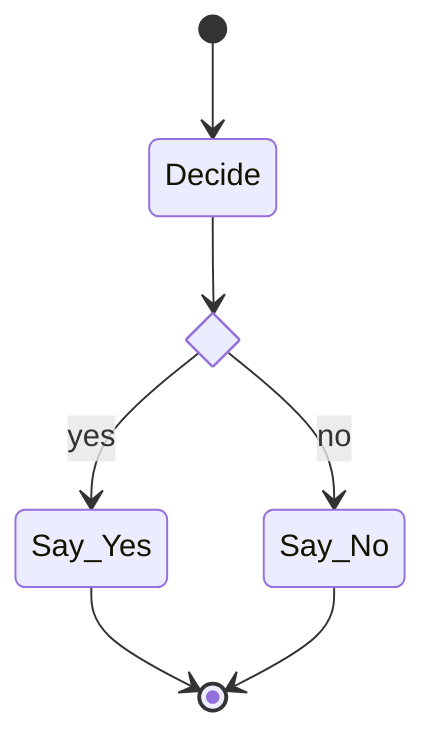

# blackbox

Single daemon for AI dev tooling: full-text search across Claude Code / Codex / Copilot / Vibe / Gemini transcripts, a unified knowledge store rendered into each provider's markdown files, work-thread tracking, and multi-provider agent orchestration with a live multi-lane tail TUI. Backed by [tantivy](https://github.com/quickwit-oss/tantivy) (Rust, BM25 ranking). Sub-50ms queries over hundreds of thousands of indexed documents.

The crate is `blackbox`. It produces two binaries:
- **`blackboxd`** — HTTP-MCP daemon (one long-lived user service, shared across all CLIs on the host)
- **`bro`** — terminal TUI for tailing live orchestration activity

---

## Quick start

Five steps. After step 5 every agent CLI on your host is talking to the same daemon, your existing `CLAUDE.md` / `AGENTS.md` / `GEMINI.md` content has been absorbed into one store, and the store is rendered back out to each provider in a consistent layered form.

### 1. Build and install the binaries

```bash
git clone https://github.com/invidious9000/transcript-search.git
cd transcript-search
cargo build --release
install -m 755 target/release/blackboxd ~/.local/bin/blackboxd
install -m 755 target/release/blackboxd ~/.local/bin/blackboxd-dev
install -m 755 target/release/bro       ~/.local/bin/bro
```

### 2. Run `blackboxd` as a systemd user service

```bash
cp deploy/blackbox.service ~/.config/systemd/user/
systemctl --user daemon-reload
systemctl --user enable --now blackbox.service
```

One daemon serves every Claude / OpenCode / Codex / Gemini / Copilot / Vibe CLI on the host, so they all share the same tantivy index, knowledge store, and orchestration state. Prod and dev should use separate installed daemon paths even when they come from the same built artifact, so restarting the dev unit never mutates the prod service binary in place. Upgrades: rebuild, `install` (atomic), `systemctl --user restart blackbox`.

Logs live in journald:
```bash
journalctl --user -u blackbox -f
```

Migration note:
On first start after the XDG-path change, `blackboxd` automatically moves legacy default stores from `~/.claude-shared/blackbox-{knowledge,threads,notes}.json`, `~/.claude-shared/transcript-index`, and `~/.bro/` into the new XDG defaults, but only when the corresponding new target does not already exist. Explicit env overrides disable that automatic migration for the overridden path.

### 2a. Run an isolated dev daemon alongside prod

Use a second unit with a different port, MCP entry name, stores, render targets, and bro runtime dir:

```bash
cp deploy/blackbox-dev.service ~/.config/systemd/user/
systemctl --user daemon-reload
systemctl --user enable --now blackbox-dev.service
```

This sample unit listens on `127.0.0.1:7265/mcp` and self-registers as `blackbox-dev`, while keeping knowledge/threads/notes/index/render backups under dev-specific XDG paths. It also runs a separate installed binary path, `~/.local/bin/blackboxd-dev`, so dev restarts and binary swaps do not touch the prod service executable.

### 2b. Build, run, or develop with Nix

The root flake now separates product outputs from contributor tooling:

```bash
nix build .#blackbox
nix run .#blackboxd
nix run .#bro
nix develop .
nix flake check
nix fmt
```

- `packages.blackbox` / `packages.default`: build the crate for consumers
- `apps.blackboxd` / `apps.bro`: run the shipped binaries without a local Rust toolchain
- `checks.default`: validates the packaged build path that consumers use
- `formatter`: `nix fmt` formats the flake with `nixpkgs-fmt`
- `devShells.default`: contributor shell with Rust/Nix tooling

### 2c. Run a fully isolated dev-agent world with Nix

The dev systemd unit isolates the daemon, but not the agent harnesses that may
still auto-read `~/.claude-shared/CLAUDE.md`, `~/.codex/AGENTS.md`, or
`~/.gemini/GEMINI.md`. For contained end-to-end testing, use the flake-backed
dev harness instead:

```bash
nix develop .#dev-agent
cp .dev-agent-links.example .dev-agent-links   # optional; keep untracked
$EDITOR .dev-agent-links                       # link only auth/session material
bbx-dev-home init
bbx-dev-blackboxd
```

Open a second shell in the same repo and launch provider CLIs through the
wrappers:

```bash
nix develop .#dev-agent
bbx-dev-claude
bbx-dev-codex
bbx-dev-gemini
```

What the harness does:

- creates an isolated home tree at `./.dev-agent/home`
- keeps config, MCP wiring, render targets, blackbox state, transcript index,
  and bro state inside that tree
- points rendered global memory at the fake home's real pickup paths:
  - `./.dev-agent/home/.claude-shared/CLAUDE.md`
  - `./.dev-agent/home/.codex/AGENTS.md`
  - `./.dev-agent/home/.gemini/GEMINI.md`
- leaves auth/session passthrough explicit via `./.dev-agent-links`

`./.dev-agent-links` is TAB-separated: `<relative-path-under-dev-home><TAB><absolute-host-path>`.
That lets you borrow only the auth material the real CLI requires while keeping
the mutable config and memory files isolated. Example:

```text
.claude/.credentials.json	/home/you/.claude/.credentials.json
.codex/auth.json	/home/you/.codex/auth.json
```

This split is intentional: auth may need to map back to host paths, but config,
MCP, render targets, and blackbox state should not.

If a provider co-locates auth with config in a single file, do not symlink your
real config wholesale unless you accept losing isolation for that provider.
Prefer copying just the auth-bearing material into the dev home or using a
provider-specific env var when the CLI supports one.

### 3. Connect your CLIs

The daemon listens on `127.0.0.1:7264/mcp` by default. Point every agent CLI at the same URL.

**Claude Code** — `~/.claude*/.claude.json`:
```json
{
  "mcpServers": {
    "blackbox": { "type": "http", "url": "http://127.0.0.1:7264/mcp" }
  }
}
```

**Codex CLI** — `~/.codex/config.toml`:
```toml
[mcp_servers.blackbox]
url = "http://127.0.0.1:7264/mcp"
```

Restart each CLI. The first transcript search will auto-build the index (1–3 minutes depending on corpus size).

For a dev daemon, add a separate MCP entry instead of replacing prod:

```json
{
  "mcpServers": {
    "blackbox": { "type": "http", "url": "http://127.0.0.1:7264/mcp" },
    "blackbox-dev": { "type": "http", "url": "http://127.0.0.1:7265/mcp" }
  }
}
```

### 4. Bootstrap your first project

`bbox_bootstrap` scans an existing repo's instruction files (`CLAUDE.md`, `AGENTS.md`, `GEMINI.md`, `PROJECT.md`, any headings it can identify) and migrates them into the unified knowledge store as discrete entries, preserving scope (global vs project) and category.

From any connected CLI, run the MCP tool directly — for example in Claude Code:

```
bbox_bootstrap(project: "/home/you/repos/my-app")
```

Review the imports with `bbox_knowledge` or `bbox_review` (new entries land as `unverified` until you approve them).

### 5. Render the store back out

Rewrite the provider instruction files from the canonical store so every agent sees the same three-layer content (steerage → shared memory → project-specific):

```
bbox_render(scope: "both", project: "/home/you/repos/my-app")
```

- **`scope=global`** — patches `~/.claude-shared/CLAUDE.md`, `~/.codex/AGENTS.md`, `~/.gemini/GEMINI.md` between `<!-- bb:managed-start -->` / `<!-- bb:managed-end -->` markers. User-authored content outside the markers (including RTK `@imports`) is preserved. Originals snapshot to `~/.local/state/blackbox/backups/<ISO-ts>/` before every write.
- **`scope=project`** — writes `<repo>/{CLAUDE,AGENTS,GEMINI}.md` with **only** project-scope entries + verbatim `PROJECT.md` content. Global entries aren't duplicated per project.
- **`scope=both`** — both. Useful on first install or for a forced re-sync.

From this point on: `bbox_learn` / `bbox_remember` to add or update, `bbox_render` to push changes out to provider files, `bbox_absorb` to pull external edits back in. See [Knowledge lifecycle](#knowledge-lifecycle) below for the full loop.

### 6. Migrate hand-authored content (one-time, per scope)

> **Critical**: pre-existing `CLAUDE.md` / `AGENTS.md` / `GEMINI.md` content is **not deleted** by `bbox_bootstrap` or `bbox_render`. Without explicit migration, the same rules end up in the file **twice** — once as your original prose, once again rendered inside the bbox managed region. Agents read both and get confused.

The migration loop is the same for global and project scope:

1. **Inspect** what bbox would write (dry-run):
   ```
   bbox_render(scope: "global",  dry_run: true)
   bbox_render(scope: "project", project: "/home/you/repos/my-app", dry_run: true)
   ```
2. **Absorb** any hand-authored content you want to keep into the store (creates `Imported` entries):
   - **Global**: `bbox_absorb(scope: "global")` reads ONLY the managed region between `<!-- bb:managed-start -->` / `<!-- bb:managed-end -->` markers. Content outside the markers (RTK steerage, your own notes) is left alone.
   - **Project**: `bbox_absorb(project: "/home/you/repos/my-app")` reads the WHOLE rendered file (project files are entirely bbox-rendered).
3. **Review + approve** the imports:
   ```
   bbox_review(action: "list")               # see imports
   bbox_review(action: "approve", id: "…")   # promote each one to verified
   ```
4. **Prune** the original hand-authored content from the file:
   - **Global** files: delete content **inside** the managed region that's now also stored in bbox; leave RTK `@imports` and your own notes outside the markers untouched.
   - **Project** files (`<repo>/CLAUDE.md` etc.): if you want everything bbox-managed, delete the entire file's contents — `bbox_render scope=project` will recreate it from the store. If you want a hybrid, leave the section above the managed region.
5. **Render** to confirm a clean output:
   ```
   bbox_render(scope: "both", project: "/home/you/repos/my-app")
   ```

After step 5 the rendered file should match the bbox managed region with no duplicates. Subsequent edits go through `bbox_learn` / `bbox_remember` (write) and `bbox_render` (publish); `bbox_absorb` is for catching out-of-band edits made directly in the rendered file.

---

## Knowledge lifecycle

Blackbox treats your provider instruction files (`CLAUDE.md`, `AGENTS.md`, `GEMINI.md`) as *rendered outputs* of a single canonical store — not as sources of truth. This lets every agent on the host see consistent content, lets you edit in any file and have it reconciled, and keeps provider-specific quirks (Copilot's greedy reading, Gemini's unsupported global memory) handled in one place.

```
  edit from a CLI               edit in a rendered file
        │                                 │
   bbox_learn /                     bbox_absorb
   bbox_remember                    (diff-based)
        │                                 │
        ▼                                 ▼
   ┌───────────────────────────────────────────────┐
   │     blackbox-knowledge.json (canonical)       │
   │  entries tagged scope, category, provider,    │
   │  verified, decay, timestamps                  │
   └───────────────────────────────────────────────┘
                        │
                   bbox_render
                        │
        ┌───────────────┼────────────────┐
        ▼               ▼                ▼
   CLAUDE.md        AGENTS.md        GEMINI.md
```

| Tool | When to use |
|---|---|
| **`bbox_bootstrap`** | New repo — scan existing instruction files and import as entries. Run once per repo. |
| **`bbox_learn`** | Add or update an entry. Entry will be rendered into provider markdown on next `bbox_render`. |
| **`bbox_remember`** | Store an on-demand fact. **NOT rendered** into markdown — searchable via `bbox_knowledge` only. |
| **`bbox_knowledge`** | List / search entries with category / scope / provider filters. |
| **`bbox_render`** | Emit the canonical store back to provider instruction files (global / project / both). |
| **`bbox_absorb`** | Detect external edits to rendered files and import them as unverified entries. `scope=project` (default) reads the whole `<repo>/{CLAUDE,AGENTS,GEMINI}.md`; `scope=global` reads only the managed region of `~/.claude-shared/CLAUDE.md` / `~/.codex/AGENTS.md` / `~/.gemini/GEMINI.md`. |
| **`bbox_review`** | Approve or reject unverified entries (from bootstrap or absorb). |
| **`bbox_forget`** | Remove or supersede an entry. |
| **`bbox_lint`** | Health check: contradictions, stale entries, duplicates. |

`bbox_render` is the write step; without it, changes stay in the store and don't reach your agents. `bbox_absorb` is the inverse — handy after you've edited a `CLAUDE.md` directly and want the change captured before a later render overwrites it.

---

## `bro tail` — multi-lane orchestration TUI

Live tail one or more bros (named agent instances) side-by-side:

```bash
bro tail alice bob                  # two specific bros
bro tail --team review-panel        # every member of a team
bro tail --provider codex           # all codex bros across all teams
```

Each lane seeds from the bro's session JSONL on disk, then follows it live. Displayed per event:
- Assistant / user / developer text — markdown rendered, code fences syntax-highlighted via `syntect`.
- Thinking blocks — italicized.
- Tool use — name + extracted target (Bash→command, Read/Edit/Write→path, Grep→pattern, etc.).
- Tool result — size, exit code (when present), preview, error-state color.
- System signals — session init, compaction, hooks, system-reminders, slash commands — rendered as inline dividers so you can see *why* an agent shifted.

**Keybindings:**

| Key | Action |
|---|---|
| `Tab` / `Shift-Tab` | Cycle selected lane |
| `f` | Fullscreen toggle on selected lane |
| `↑`/`↓` or `k`/`j` | Scroll 1 line |
| `PgUp`/`PgDn` | Scroll one page |
| `g` / `Home` | Jump to top |
| `G` / `End` | Jump to bottom (live mode) |
| `q` / `Esc` / `Ctrl-C` | Quit |

**Mouse:**

| Action | Effect |
|---|---|
| Click lane body | Sets that lane as selected |
| Click + drag on divider | Resize adjacent lanes (±1 col detection, 12-col minimum) |
| Wheel up/down | Scrolls lane under cursor (no Tab required) |

Footer per lane shows `● LIVE` or `⏸ -N` when scrolled up, plus running counts (text / tool / thinking / signal events). Scroll position stays anchored to content when new events arrive.

Five providers at parity: Claude (`.jsonl`), Codex (`.jsonl`), Gemini (`.json` single-object), Copilot (`session-state/<id>/events.jsonl`), Vibe (`logs/session/.../messages.jsonl`).

---

## `bro orchestrate` — workflow engine

Protocol-level orchestration: define a workflow as a mermaid state-diagram plus actor/node metadata, then dispatch it. The daemon owns the loop; the CLI is a courier. Intended as the replacement for long skill-prose protocols (overmind, crucible) that required the top-most LLM to cosplay a state machine across hundreds of turns.

```bash
bro orchestrate run <workflow.json> [--project-dir <path>] [--max-steps N] [--dry-run] [--stream]
bro orchestrate status <thread-id>
bro orchestrate list [--limit N]
bro orchestrate peek [<thread-id>]
```

- **`run`** — reads the file, POSTs to `/orchestrate` (or `/orchestrate/stream` with `--stream`), blocks until termination or streams events live. `--dry-run` validates the spec + prints the plan without dispatching.
- **`status <thread-id>`** — fetches the notes posted to the arc's thread over its lifetime + the most recent compaction anchor. Post-hoc audit trail.
- **`list`** — recent workflow arcs with final status + latest anchor. Catalog view.
- **`peek [<thread-id>]`** — live in-flight state: current node, completed/in-flight/visit counts. Without an id, dumps every live arc snapshot.

MCP tools: `bro_orchestrate_run` dispatches a workflow. `bro_orchestrate_author` compiles a prose charter into a validated workflow spec via an authoring LLM, closing the authoring loop (operators describe arcs in prose, get a spec back, dispatch).

Every `run` opens a `bbox_thread(kind=work_item)` automatically; the returned `arc_thread_id` makes the arc discoverable via `bbox_inbox`, `bbox_notes`, `bbox_thread_list`. Sub-workflows open their own threads; you get a tree of arcs without any additional bookkeeping. The rolling `ANCHOR` compaction notes at each boundary let observers reconstruct state without reading every event.

**Why the daemon owns the loop.** An LLM maintaining workflow state across turns drifts: forgets phases, re-litigates settled decisions, invents new steps to paper over mistakes, dies on context compaction. A CLI-driven loop doesn't — it has no context to forget. LLMs become stateless function calls dispatched *into* the loop rather than the loop's substrate.

### Workflow shape

A workflow file has two halves: structured metadata and an embedded mermaid `stateDiagram-v2`. The daemon parses and cross-validates both before any dispatch.

```json
{
  "name": "e2e-smoke",
  "version": 1,
  "actors": {
    "haiku": { "kind": "executor", "brofile": "probe-haiku", "durable": true }
  },
  "nodes": {
    "Greet": { "actor": "haiku", "prompt": "Say hello briefly." },
    "Riff":  { "actor": "haiku", "prompt": "Riff on: ${Greet.output}" }
  },
  "graph": "stateDiagram-v2\n    [*] --> Greet\n    Greet --> Riff\n    Riff --> [*]"
}
```

**Actors** declare WHO runs each turn. Four kinds:
- `executor` — single bro, dispatched via `bro_exec` / `bro_resume`. `durable: true` reuses the same session across every node that invokes this actor.
- `ensemble` — team broadcast via `bro_broadcast`. Each member runs the same prompt concurrently; the node's output is the labeled concatenation of all member outputs.
- `advisor` — like executor but conventionally narrower tool surface / persona lens.
- `user` — human escalation point. Hitting a user node halts the arc with a `blocked` note carrying the prompt; resume is an operator action (currently re-dispatch the workflow with whatever state change resolves the pause; arc-state resume is phase-next).

**Nodes** declare the unit of work. Fields:
- `actor` (required unless `subworkflow` is set) — references `actors`
- `prompt` — template with `${NodeName.output}` substitution from earlier nodes (including async sources joined via `late_inject`)
- `gate` — optional packet ID; applied after the node completes. The packet's classification becomes the verdict for the next choice node.
- `retry.max_generations` — visit-count ceiling. Each re-entry (including back-edges through choice nodes) bumps the count; exceeding halts the arc. Retry prompts get a `[retry — attempt N, prior gate verdict: X]` prepended automatically.
- `mode` — `sync` (default) or `fire_and_forget`. Fire-and-forget dispatches and advances without waiting; a downstream node declaring `late_inject` joins it later.
- `late_inject.from` — name of a source node whose output is folded into this node's prompt at its entry (waits with timeout if still running). Enables the optimistic-review pattern where async steering lands on the next turn boundary.
- `subworkflow` — full inline workflow spec. When present, the node runs the sub-workflow to completion instead of dispatching an actor; the sub-workflow's node outputs are concatenated (with member labels) and stored as this node's output. Sub-arcs open their own `bbox_thread` so the call tree is fully auditable.

**Graph** is the embedded mermaid. The parser accepts a narrow subset of `stateDiagram-v2`:
- `[*]` start / end markers
- `A --> B` sequential edges
- `A --> B: label` labeled edges (consumed by choice nodes to select by verdict, and by fork nodes to denote async branches)
- `state X <<choice>>` — routing node; selects the outgoing edge whose label matches the last gate verdict
- `state X <<fork>>` — dispatches every outgoing edge's target; the first outgoing edge is the sync continuation, the rest are fire-and-forget branches whose handles are held for `late_inject` joins
- `state X <<join>>` — declared, not yet executed (use `late_inject` for equivalent shapes today)
- `%%` comments

The graph is cross-validated against the metadata: every activity node in the graph must have a matching `nodes[...]` entry, every `nodes[...]` entry must be reachable in the graph, every `actor` reference must resolve (unless the node is a subworkflow), every `late_inject.from` must reference a real node, every fork must have at least 2 outgoing edges, and embedded sub-workflows compile recursively so errors surface at parent-compile time. Every gate packet reference is resolved at dispatch time.

### Gate-driven branching

A workflow branches by compiling a rule-packet whose classifications match edge labels on a choice node:

```json
"Decide": {
  "actor": "haiku",
  "prompt": "Output exactly YES or NO.",
  "gate": "packet-05f4ba16"
},
"Say_Yes": { "actor": "haiku", "prompt": "Celebrate briefly." },
"Say_No":  { "actor": "haiku", "prompt": "Sigh briefly." }
```



After `Decide` completes, its output is handed to `packet-05f4ba16` (a packet with lattice `["yes", "no"]`). The packet's classification becomes the verdict; the choice node `Decide_Route` picks whichever outgoing edge label matches. Back-edges in the graph become natural retry loops, gated on the circuit breaker in `retry.max_generations`.

### Workflow-level policy packets — advisor as packet

A workflow can declare a top-level `policy_packet: <id>`. The engine builds an arc-state entity at each node boundary (`step`, `just_ran`, `next`, `completed`, `completed_count`, `in_flight`, `in_flight_count`, `last_verdict`, `visit_counts`) and applies the packet. The classification is an arc-level verdict:

- `halt` — stop the arc immediately (error exit with the reason on the arc thread)
- `escalate` — write a `blocked` note to the arc thread, continue
- `warn` — write a `surprise` note, continue
- anything else (including the default `continue`) — no-op

This is the mechanization of the advisor loop: instead of dispatching an LLM at every boundary to read the checkpoint and say `CONTINUE | ESCALATE | CHARTER_DRIFT | EXIT_MET`, compile those rules into a packet once and let them evaluate deterministically. Useful for runaway-visit detectors, time / step ceilings, arc-shape invariants, and any other rule where the LLM's judgment adds latency without adding accuracy.

### What's currently implemented (v0.4)

- Actor kinds: `executor` (exec+resume), `ensemble` (broadcast+join), `advisor` (executor lens), `user` (pause+note)
- Graph shapes: sequential edges, `<<choice>>` verdict routing, `<<fork>>` sync-continuation + fire-and-forget branches, back-edges (retry loops)
- Gate packets via `bbox_apply` on the packet store; classifications become edge-label matchers
- Retry ceilings via per-node visit counts + `retry.max_generations`
- `${NodeName.output}` prompt substitution, including late-bound source outputs
- `late_inject.from` joins an async source's output into a downstream node's brief at its entry
- `subworkflow` — fully compositional; nested arcs get their own `bbox_thread`
- `fire_and_forget` node mode dispatches without blocking
- Arc-thread persistence: every `run` opens a `bbox_thread(kind=work_item)`; structured notes (`done`, `learned`, `surprise`, `blocked`) trail every major event
- Compaction anchors: rolling `ANCHOR [step N, …]` notes at each boundary summarize arc state for observers that don't want to read every event
- `--dry-run` validates + summarizes without dispatching
- `bro orchestrate status <thread-id>` dumps the arc's note trail + latest anchor
- `bro orchestrate list` catalogs recent arcs; `bro orchestrate peek` shows live state for in-flight arcs
- `bro orchestrate run --stream` emits SSE events live during the run instead of blocking
- Workflow-level `policy_packet` — advisor-as-packet, deterministic arc-health rules applied at every boundary
- Gate-packet modes: `first` (single verdict) or `all` (multi-finding aggregate, lattice-highest classification)
- `<<join>>` control nodes for synchronous fan-in after fork
- Parent outputs seeded into sub-workflow runners so sub templates can reference `${ParentNode.output}` identically to siblings
- `bro_orchestrate_author` MCP tool — prose-charter → validated spec via authoring LLM; auto-retries on compile failure

### Phase-next

- `bro orchestrate resume <thread-id>` — genuine re-entry at the last recorded step for arcs that paused or errored. Needs persistent full-output snapshots to survive daemon restarts.
- YAML workflow loader (JSON-only today; one-line add once `serde_yaml` is introduced).
- Workflow templates on the daemon (referenceable by name instead of inlined per spec) — mirrors rule-packet composition via `Apply`. Same shape, one layer up.
- Auto-prune of `running_arcs` registry + persistence across daemon restarts so `peek` works after a restart.

See [`examples/workflows/`](examples/workflows/README.md) for runnable examples and a deeper walkthrough.

---

## MCP tools reference

### Transcript search (`bbox_*`)

| Tool | Description |
|---|---|
| `bbox_search` | Full-text query with filters (account, project, role, include_subagents, limit). Terms ANDed by default; supports `OR`, `"phrase queries"`. Returns ranked results with highlighted excerpts. |
| `bbox_messages` | Read a session's conversation flow. Accepts `session_id` or `file_path`. Supports `role` filter, `from_end` (tail mode), `offset`/`limit` pagination, `max_content_length`. |
| `bbox_context` | Surrounding messages around a search hit (given file path + byte offset). |
| `bbox_session` | Session metadata: first prompt, project, duration, tool usage, message counts. |
| `bbox_topics` | Top terms from a session by frequency analysis (no LLM). Stop-word filtered. |
| `bbox_sessions_list` | Browse sessions across accounts, sorted by recency. Filter by account, project. |
| `bbox_reindex` | Incremental (default) or full rebuild. Only re-processes new/modified files. |
| `bbox_stats` | Corpus statistics: document count, index size, per-account file counts. |

### Knowledge store (`bbox_*`)

See [Knowledge lifecycle](#knowledge-lifecycle) for the narrative — quick reference here.

| Tool | Description |
|---|---|
| `bbox_bootstrap` | Scan an existing repo's instruction files and migrate them into the knowledge store. |
| `bbox_learn` | Add / update a knowledge entry. Rendered into provider markdown on next `bbox_render`. |
| `bbox_remember` | Store a fact for on-demand recall only — NOT rendered into markdown. |
| `bbox_knowledge` | List / search knowledge entries with category / scope / provider filters. |
| `bbox_render` | Render entries → CLAUDE.md / AGENTS.md / GEMINI.md (steerage → memory → PROJECT.md). |
| `bbox_absorb` | Detect external edits to rendered files and import them as unverified entries. |
| `bbox_review` | Review unverified entries — list, approve, reject. |
| `bbox_forget` | Remove or supersede an entry. |
| `bbox_lint` | Health check: contradictions, stale entries, duplicates. |

### Work threads (`bbox_*`)

| Tool | Description |
|---|---|
| `bbox_thread` | Manage long-running work threads — friendly names, edges to other threads/sessions, notes. |
| `bbox_thread_list` | List / scan threads (open / active / stale by default). |

### Multi-provider orchestration (`bro_*`)

Dispatch agent tasks to Claude, OpenCode, Codex, Copilot, Vibe, or Gemini and coordinate them as teams.

| Tool | Description |
|---|---|
| `bro_exec` | Launch an agent task. Returns `{taskId, sessionId}` immediately. |
| `bro_resume` | Resume a previous agent session with a follow-up prompt. |
| `bro_wait` / `bro_when_all` / `bro_when_any` | Block until one / all / first task(s) complete. Emits MCP progress notifications (client-echoed `progressToken`) with a multi-lane activity snapshot every 15s. |
| `bro_broadcast` | Send the same prompt to every team member. |
| `bro_status` | Non-blocking progress check. |
| `bro_cancel` | Send SIGTERM to a running task. |
| `bro_dashboard` | List recent tasks and sessions. |
| `bro_providers` | Show configured providers, binaries, and model/effort catalogs. |
| `bro_brofile` | Manage brofile templates and named accounts. |
| `bro_team` | Manage team templates and live teams. |

### HTTP endpoints (non-MCP)

| Path | Description |
|---|---|
| `GET /mcp` | MCP streamable-HTTP transport. All client CLIs connect here. |
| `GET /tail` | SSE stream of orchestration lifecycle events. Filter via `?team=`/`?bro=`/`?provider=`. |
| `GET /roster` | Resolves `?bros=a,b&team=X&provider=Y` selectors → `[{bro, team, provider, session_id, jsonl_path, model}]`. Used by `bro tail` to locate transcript files. |

---

## What gets indexed

| Source | Event type | Index role |
|---|---|---|
| Claude Code | User messages | `user` |
| Claude Code | Assistant text | `assistant` |
| Claude Code | Thinking blocks | `thinking` |
| Claude Code | Tool use (name + input) | `tool_use` |
| Claude Code | Tool results | `tool_result` |
| Claude Code | Subagent transcripts | all roles, `is_subagent=1` |
| Codex CLI | User / assistant / developer messages | `user`, `assistant`, `developer` |
| Codex CLI | Function calls | `tool_use` |
| Codex CLI | Function results | `tool_result` |
| Codex CLI | Reasoning blocks | `thinking` |
| Both | Command history | `user` |

Content is capped at 12KB per document. Responses are capped at 80KB to avoid blowing MCP result limits.

`bro tail` reads a richer `TranscriptEvent` model that preserves tool-call structure and out-of-band system signals — the indexer projects that down to the flat `ParsedEvent` shape it needs.

---

## Provider catalog

Maintained in `src/orchestration/providers.rs`:

- **Claude** — Opus 4.7 (default, 1M context built-in), Opus 4.6, Sonnet 4.6, Haiku 4.5. Effort tiers `low`/`medium`/`high`/`xhigh`/`max` (default `xhigh`; `xhigh` is Opus-4.7-only, `max` unsupported on Haiku). Runs with `--include-partial-messages` so progress notifiers see true delta streaming.
- **OpenCode** — native `provider/model` execution. Current catalog exposes Z.AI Coding Plan GLM models directly, defaults to `zai-coding-plan/glm-5.1`, and uses OpenCode variants `minimal`/`low`/`medium`/`high`/`max`.
- **Codex** — gpt-5.4 family. Efforts `minimal`/`low`/`medium`/`high`/`xhigh`.
- **Copilot** — Anthropic + OpenAI models. Efforts `low`/`medium`/`high`/`xhigh`.
- **Vibe**, **Gemini** — model lists only.

---

## Configuration

Auto-detection works out of the box for most setups. Override via environment variables (typically via a systemd unit drop-in — see *Multi-account example* below).

| Env var | Default | Description |
|---|---|---|
| `TRANSCRIPT_SEARCH_ROOTS` | auto-detect `~/.claude` + `~/.claude-*` | Account roots. Format: `name=/path,name2=/path2` |
| `TRANSCRIPT_SEARCH_CODEX_ROOT` | `~/.codex` if it exists | Codex CLI data directory |
| `TRANSCRIPT_SEARCH_INDEX_PATH` | `~/.local/share/blackbox/index` | Tantivy index location |
| `BLACKBOX_MCP_NAME` | `blackbox` | MCP server name used for self-registration and transient provider injection |
| `BLACKBOX_STATE_DIR` | `~/.local/state/blackbox` | Base dir for default bbox JSON stores when explicit per-store paths are unset |
| `BLACKBOX_KNOWLEDGE_PATH` | `<state-dir>/blackbox-knowledge.json` | Knowledge store path |
| `BLACKBOX_THREADS_PATH` | `<state-dir>/blackbox-threads.json` | Thread store path |
| `BLACKBOX_NOTES_PATH` | `<state-dir>/blackbox-notes.json` | Notes store path |
| `BRO_HOME` | `<state-dir>/bro` | Base dir for task store, MCP registry, and Gemini policy tempfiles |
| `BLACKBOX_REINDEX_INTERVAL_SECS` | `120` | Background reindex interval (seconds) |
| `BBOX_PORT` / `BRO_PORT` | `7264` | HTTP port for MCP + `/tail` + `/roster` endpoints |
| `BLACKBOX_GLOBAL_CLAUDE_MD` / `BLACKBOX_GLOBAL_CODEX_MD` / `BLACKBOX_GLOBAL_GEMINI_MD` | provider defaults | Override global render targets; useful for dev instances that must not touch prod memory files |
| `BLACKBOX_BACKUP_DIR` | `~/.local/state/blackbox/backups` | Managed-region backup root for `bbox_render(scope=global)` |
| `CLAUDE_BIN` / `OPENCODE_BIN` / `CODEX_BIN` / `COPILOT_BIN` / `GEMINI_BIN` / `VIBE_BIN` | from `$PATH` | Override provider binary paths |
| `RUST_LOG` | `blackbox=info` | Tracing filter |

### Auto-detection

By default the server:
1. Always includes `~/.claude` as the `claude` account.
2. Scans `~/` for any `~/.claude-*` directories that contain a `projects/` subdirectory.
3. Includes `~/.codex` if `~/.codex/sessions/` exists.

### Multi-account example

Override account roots via a systemd unit drop-in:

```ini
# ~/.config/systemd/user/blackbox.service.d/accounts.conf
[Service]
Environment=TRANSCRIPT_SEARCH_ROOTS=personal=%h/.claude,work=%h/.claude-work
```
Then `systemctl --user daemon-reload && systemctl --user restart blackbox`.

---

## Transcript schemas (appendix)

**Claude Code** — `~/.claude/projects/<encoded-path>/<session-uuid>.jsonl`:
```jsonc
{"type": "user|assistant|system|summary", "message": {...}, "sessionId": "uuid", "timestamp": "ISO-8601", ...}
```

**Codex CLI** — `~/.codex/sessions/YYYY/MM/DD/rollout-<ts>-<uuid>.jsonl`:
```jsonc
{"timestamp": "ISO-8601", "type": "session_meta|response_item|event_msg", "payload": {...}}
```

**Gemini** — `~/.gemini/tmp/<project>/chats/session-<ts>-<first8>.json` (single JSON object, not JSONL):
```jsonc
{"sessionId": "uuid", "messages": [{"id", "timestamp", "type": "user|gemini", "content", "thoughts": [...], ...}]}
```

**Copilot** — `~/.copilot/session-state/<full-session-id>/events.jsonl`:
```jsonc
{"type": "session.start|user.message|assistant.message|tool.execution_start|tool.execution_complete|...", "data": {...}, "id", "timestamp", "parentId"}
```

**Vibe** — `~/.vibe/logs/session/session_<date>_<time>_<first8>/messages.jsonl`:
```jsonc
{"role": "user|assistant|tool", "content": "...", "tool_calls": [...], "tool_call_id": "...", "message_id": "..."}
```

---

## Architecture

- **Tantivy** for full-text indexing with BM25 ranking, phrase queries, and positional indexing.
- **Separate documents per content block** — each text / thinking / tool_use block is its own document, enabling role-based filtering and precise excerpts.
- **Incremental indexing** via file mtime/size tracking; background reindex thread runs every 120s.
- **MCP over streamable HTTP** — `rmcp` crate as transport, axum for auxiliary `/tail` and `/roster` endpoints. Progress notifications echo the caller's `progressToken` per spec.
- **Knowledge render pipeline** — three-layer composition (steerage → shared memory → per-project PROJECT.md) into provider-specific markdown, with atomic-replace safety and external-edit absorption.
- **Multi-provider orchestration** — spawns provider CLIs as child processes, streams JSON events, manages task lifecycle, team coordination, and SSE broadcast to `/tail` subscribers.
- **Two-layer transcript model** — `parser::TranscriptEvent` (rich, tool-call structured, system-signal aware) for the `bro tail` TUI; projected to `ParsedEvent` for the flat tantivy doc shape.
- **No LLM calls** — pure local indexing and retrieval. `bbox_topics` uses term frequency, not embeddings.

Source layout (`src/`):

- **main.rs** — `rmcp` server with `#[tool]`-annotated handlers, axum routes for `/tail` / `/roster`, progress-notifier plumbing, signal handling.
- **cli.rs** — `bro` binary. Ratatui TUI with per-lane seed-from-history + live follow, tui-markdown + syntect rendering, crossterm mouse capture.
- **index/** — Tantivy lifecycle, schema, search / browse / session handlers, incremental reindex thread, session-file discovery.
- **parser.rs** — Claude / Codex / Gemini / Copilot / Vibe JSONL parsers emitting both rich `TranscriptEvent` and flat `ParsedEvent`.
- **knowledge.rs**, **render.rs** — Knowledge CRUD and three-layer markdown render pipeline.
- **threads.rs** — Work-thread tracker.
- **orchestration/** — Provider catalogs, exec/resume arg builders, brofile/team persistence, task lifecycle, tail event stream, bro-name ↔ session-id resolution.

---

## Examples

Drop-in configs for wiring blackbox into agent CLIs live in [`examples/`](examples/README.md):

- **Agents** — [`session-searcher`](examples/agents/session-searcher.md): read-only subagent that keeps transcript digging off your main context window.
- **Skills / slash commands** — [`crucible`](examples/skills/crucible.md) (orchestrator + durable implementer + continuous red-team ensemble, coordinated through a `bbox_thread(kind="work_item")` and structured `bbox_note` signals), [`takeover`](examples/skills/takeover.md) (pick up a stalled or handed-off agent session without losing scope), and [`overmind`](examples/skills/overmind.md) (meta-orchestration — strategic Advisor above crucible, with a durable spine doc that survives orchestrator compaction; demonstrates the legitimate `allow_recursion=true` pattern).

---

## License

MIT
