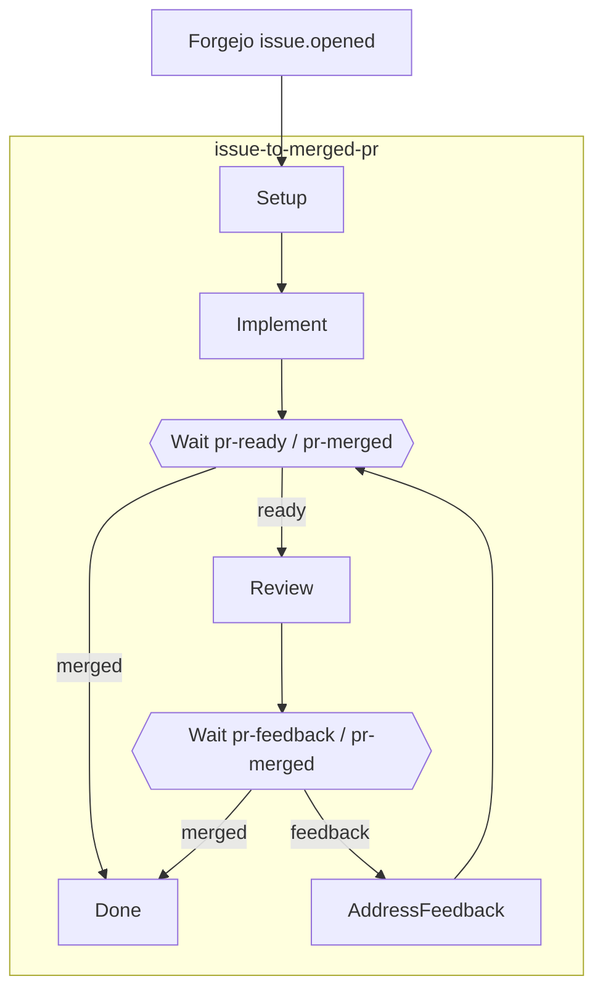
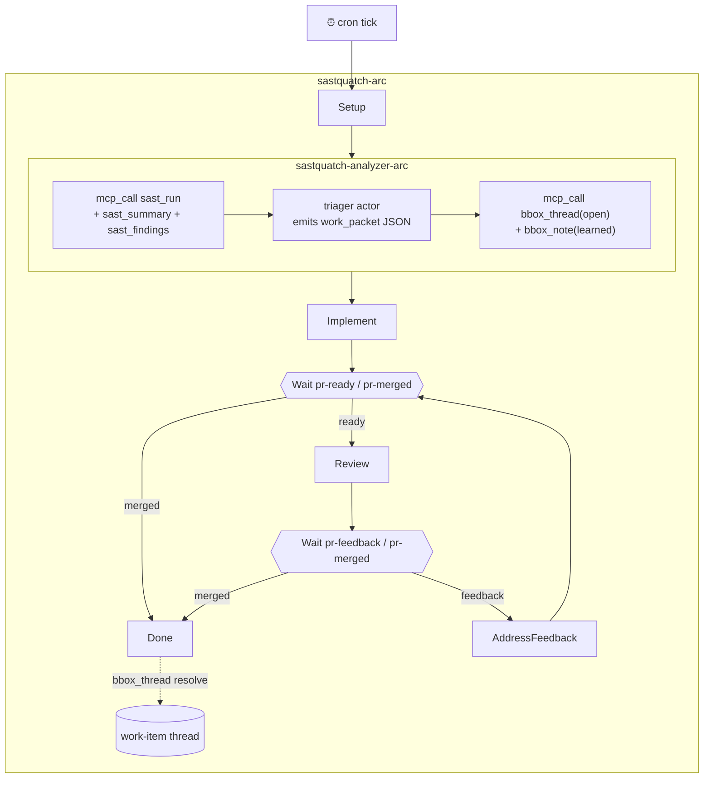

# Reference Implementations

Blackbox ships two kinds of runnable material:

- `examples/` contains tutorial specs and full integration demos that users copy
  and adapt.
- `system-defaults/` contains blackbox-owned installable artifacts: atoms,
  Badgey artifacts, refactor personas, agentic-corpus producer machinery, legacy
  registered agents, and MCP surface packets.

The daemon does not read either tree automatically. Install only the artifacts
you want.

## Keystone - issue → PR → review → merge

`examples/keystone/`

A Forgejo webhook fires on `issue.opened`. The engine dispatches an
implementer team to fix the bug and open a PR, waits on a `pr-ready`
signal, spins up a reviewer ensemble, loops on `pr-feedback` until
merged or the iteration cap is hit, then runs cleanup hooks at terminal
state.

This is the canonical workflow-engine reference: it exercises every
major primitive in one connected arc.



### What it exercises

| Feature | Where |
|---|---|
| Subworkflow composition + import/export contract | `issue-to-merged-pr.json` calls `implementer-arc` and `reviewer-arc` by id |
| `vars_schema` seeded from webhook entity | Every sub-workflow declares one |
| `${vars.x}` / `${env.X}` / `${last_signal.x}` templates | Used throughout; env carries Forgejo credentials |
| Hook ops: `set_var`, `inc_var`, `parse_json`, `worktree_create`, `worktree_remove`, `shell`, `http_json` | Setup, Wait on_exit, PushAndOpenPr, FetchDiff, PostReview, arc_exit |
| Hook gating via `when: domain:...` packet | Idempotent PR create-or-reopen, auto-merge on approve |
| `wait` with `any_of` race + `__timeout__` graceful-degrade | AwaitReviewTrigger (24 h), AwaitFeedbackOrMerge (7 d) |
| `branch` transition routing on gate verdict | Both Wait nodes |
| Workflow-level policy packet (advisor-as-packet) | Arc budget caps step count |
| Generic `http_json` for all code-host calls | Issue fetch, PR list/create, diff, review post, merge |
| `find_first` for client-side array filtering | Finds existing open PR by branch without platform search API |
| Typed correlation tuples | Two concurrent arcs on different PRs don't cross-resume |
| Poller inlet (alternative to webhook) | `pollers/forgejo-open-issues.json` (opt-in) |

### Quick start

```sh
cd examples/keystone
./scripts/run.sh                    # docker up → bootstrap → install → wait for webhook
./scripts/run.sh --dispatch         # skip webhook; dispatch arc directly against issue #1
./scripts/run.sh --skip-forgejo     # if Forgejo is already running
```

### Layout

```
examples/keystone/
├── docker-compose.yaml
├── packets/          - routing-forgejo, gate-merge-or-review, gate-loop-or-exit, …
├── webhooks/         - forgejo.json (hmac_sha256 signature scheme)
├── pollers/          - forgejo-open-issues.json (opt-in alternative)
├── workflows/        - issue-to-merged-pr, implementer-arc, reviewer-arc, …
└── scripts/          - bootstrap.sh, install.sh, run.sh
```

---

## SASTquatch - cron → SAST → fix → PR → review → merge

`examples/sastquatch/`

A calendar-driven sibling of Keystone. A daily cron tick fires the arc;
the analyzer discovers findings via biofilter's `sast_run`/`sast_summary`
MCP calls, a triager picks the highest-value cluster, a fixer applies
the fix and opens a PR, a reviewer ensemble votes, and the arc
auto-merges on approval.

SASTquatch inverts three Keystone axes simultaneously - cron vs. webhook
trigger, analyst-discovered vs. operator-supplied input, triager actor
vs. none - each inversion forcing a new engine primitive.



### What it exercises

| Feature | Where |
|---|---|
| Cron inlet (calendar-driven, no upstream event) | `crons/sastquatch-daily.json`, `concurrency: 1` (skip ticks while in-flight) |
| `mcp_call` op (engine-level outbound MCP) | Analyzer fires `sast_run` / `sast_summary` on biofilter (stdio MCP); arc hooks call `bbox_thread` / `bbox_note` on blackbox-self (HTTP MCP) |
| `triager` actor kind | `PickCluster` - emits structured JSON; `parse_json on_exit` enforces the contract |
| Work-item thread as typed envelope | Analyzer opens `bbox_thread(kind=work_item)`, threads `thread_id` through every sub-arc |
| Subworkflow composition (5 specs) | Analyzer, fixer, reviewer, feedback sub-arcs |
| Hook-only nodes (no LLM dispatch) | Setup, RunSast, OpenWorkItem, FetchDiff, PushAndOpenPr, PostReview, Done |
| `wait` nodes with typed correlation | Two concurrent arcs on different PRs don't cross-resume |
| SAST-regression guard | Fixer's `on_exit` re-runs `sast_run`; result in `vars.sast_after_fix` for downstream |

### Prerequisites

Same as Keystone, plus biofilter MCP server registered in `~/.bro/mcp.json`.
Verify: `curl -s http://127.0.0.1:7264/mcp ... | jq '.result.tools[] | select(.name | startswith("mcp__plugin_biofilter"))'`

### Quick start

```sh
cd examples/sastquatch
./scripts/run.sh --soon     # rewrites cron to fire in ~30s; waits for tick
./scripts/run.sh --dispatch # immediate arc against the seeded crate, no cron wait
./scripts/run.sh            # 9am daily schedule
```

### Layout

```
examples/sastquatch/
├── docker-compose.yaml
├── crons/         - sastquatch-daily.json (concurrency=1)
├── packets/       - routing-cron, routing-webhook, hook-when-has-work-item
├── webhooks/      - sastquatch.json (PR event extractor)
├── workflows/     - sastquatch-arc, analyzer-arc, fixer-arc, reviewer-arc, feedback-arc
└── scripts/       - bootstrap.sh (seeds buggy Rust crate + sast-bridge.json), install.sh, run.sh
```

---

## System Defaults

Installable blackbox-owned artifacts live under
`system-defaults/`. These are shipped defaults rather than tutorial
examples: atoms, Badgey artifacts, refactor personas, agentic-corpus
producer machinery, legacy registered agents, and MCP surface packets.

For catalog mechanics and install order, see
[Artifact Catalog And System Defaults](artifact-catalog.md).

Use [Atoms](atoms.md) for the full atom contract and runtime reference.

### Atoms

| Path | Purpose |
|---|---|
| `system-defaults/atoms/basic/echo.json` | Deterministic atom smoke test; returns invocation args under `echo`. |
| `system-defaults/atoms/basic/validate-schema.json` | Deterministic object-shape probe. |
| `system-defaults/atoms/workflows/echo-review.json` | Workflow-backed atom wrapper around `system-defaults/workflows/atoms/echo-review.json`. |
| `system-defaults/atoms/refactor/rust-test-island-extract.json` | Profile-backed refactor atom using the Rust refactor persona. |

Install:

```
bbox_artifact_install(kind="atom", source="system-defaults/atoms/basic/echo.json")
atom_invoke(atom="atom:echo@v1", args={"message":"hello"})
```

Workflow-backed atoms also require the referenced workflow artifact:

```
bbox_artifact_install(kind="workflow", source="system-defaults/workflows/atoms/echo-review.json")
bbox_artifact_install(kind="atom", source="system-defaults/atoms/workflows/echo-review.json")
```

Profile-backed refactor atoms also require their language persona brofile:

```
bbox_artifact_install(kind="brofile", source="system-defaults/brofiles/refactor/rust-refactor-persona.json")
bbox_artifact_install(kind="atom", source="system-defaults/atoms/refactor/rust-test-island-extract.json")
```

### Agentic Corpus - producer machinery

`system-defaults/agentic-corpus/`

Workflows, packets, brofiles, and crons that drive the daemon's own
knowledge-maintenance arcs: auto-digesting sessions into knowledge
candidates, proposing entity edges, detecting contradictions, and
compacting the embedding index.

These are the artifacts the daemon ships as sane defaults. They are
functional but several depend on engine primitives still in progress; see the
[Agentic Corpus Defaults](../system-defaults/agentic-corpus/agentic-corpus-defaults.md)
status section.

### Workflows

| Workflow | Purpose |
|---|---|
| `auto-digest-arc.json` | Distill a session into knowledge candidates via `digest-extractor` brofile, gate via entry-quality packet |
| `auto-edge-arc.json` | Propose knowledge↔knowledge / knowledge↔file edges via vote panels |
| `contradiction-review-arc.json` | Open a whiteboard, dispatch three specialist brofiles, synthesize a verdict |
| `embed-compaction-arc.json` | Re-embed + WAL compaction sweep |
| `schema-migration-arc.json` | Drain compaction targets after a schema bump |
| `project-bootstrap-arc.json` | Stub fired by `bbox_project_register` (stub - chunking wired in the reindex thread) |

### Brofile panels

- **Auto-digest**: `digest-extractor`
- **Auto-edge** DESCRIBES vote: `describe-narrative-cohesion`, `describe-prose-signal`, `describe-symbol-fit`
- **Auto-edge** REFERENCES vote: `reference-citation-precision`, `reference-context-fit`, `reference-target-existence`
- **Contradiction-review**: `contradiction-coherence`, `contradiction-lifecycle`, `contradiction-provenance` (specialists) + `contradiction-facilitator` (synthesizer)

### Install

The daemon does not auto-install these on startup. Install what you want:

```
bbox_artifact_install(kind="workflow", source="system-defaults/agentic-corpus/workflows/auto-digest-arc.json")
bbox_artifact_install(kind="packet",   source="system-defaults/agentic-corpus/packets/auto-digest/entry-quality.json")
bbox_artifact_install(kind="cron",     source="system-defaults/agentic-corpus/crons/embed-compaction-nightly.json")
```

Use `bbox_artifact_list` to inspect what's installed.

---

## Workflow pattern catalog

`examples/workflows/` and `system-defaults/agents/workflows/`

Minimal standalone specs that demonstrate individual engine primitives.
Use as copy-paste starting points before reaching for a full example
like Keystone.

### Core patterns (`examples/workflows/`)

| File | Pattern | Key primitives |
|---|---|---|
| `e2e-smoke.json` | Linear two-turn durable actor | `durable: true`, `${NodeName.output}` substitution |
| `e2e-gated.json` | Gate packet + branch | `gate`, `branch` transition, `cases` routing |
| `e2e-async-review.json` | Fork + fire-and-forget + late_inject | `fork`, `fire_and_forget`, `late_inject.from` |
| `e2e-fork-join.json` | Fork + explicit fan-in | `fork`, `wait_for: [...]` at downstream node |
| `e2e-ensemble-vote.json` | Concurrent ensemble + aggregation | `ensemble` actor, `bro_broadcast`, stable output ordering |
| `e2e-composition.json` | Inline sub-workflow as a node | `subworkflow` field, sub-arc output concatenation |
| `e2e-policy.json` | Workflow-level policy packet | `policy_packet`, arc-state entity, halt/escalate/warn verdicts |
| `e2e-self-audit.json` | Multi-phase back-edge critique loop | `retry.max_generations`, durable auditor, `branch` back-edge |
| `e2e-review-mode.json` | Gate applied to actor output (review mode) | `gate_mode: "all"` - runs ALL packet rules, not just first match |
| `e2e-combo.json` | Gated retry loop + inline sub-workflow | Combines `retry`, `branch`, and inline `subworkflow` in one arc |
| `e2e-atom-binding.json` | Workflow-local atom binding | `atom_bindings`, atom node dispatch, normalized `atom_status` output |
| `blind.json` | Blind-convergence deliberation | Ensemble critique → converged branch → executor implements → fresh review |
| `optimistic.json` | Async ensemble steering | `fork` + `fire_and_forget` + `late_inject` with ensemble actor |

### `foreach` - bounded parallel iteration over a list

A `foreach` node fans out a sub-workflow once per item in an array
variable, runs up to `parallelism` items concurrently, and collects
results into a `vars` key. No actor declared on the node - iteration
is pure engine machinery.

```json
{
  "ForeachBinding": {
    "actor": "",
    "foreach": {
      "items": "${vars.bindings_response.bindings}",
      "as_var": "binding",
      "subworkflow_ref": "badgey-triage-channel-arc",
      "imports": [],
      "exports": [],
      "parallelism": 2,
      "on_item_failure": "continue",
      "collect": { "into_var": "channel_results" }
    },
    "next": { "type": "terminal" }
  }
}
```

`on_item_failure` values:

| Value | Behaviour |
|---|---|
| `continue` | Failed item's result is `{status: "failed", error: "..."}` in the collect array; remaining items keep running |
| `collect_then_halt` | Let all in-flight items finish, collect results, then halt the arc |
| `halt` | Cancel in-flight items, halt immediately |

`collect.into_var` must be declared `kind: "array"` in `vars_schema`.
The collected array entries have shape `{item: <input>, result: <sub-arc output>, status: "ok"|"failed"}`.

Live example: `system-defaults/badgey/workflows/badgey-triage-fanout-arc.json`
(channel bindings fanout) and `badgey-triage-channel-arc.json` (scout
fanout at `parallelism: 3`, proposal posting at `parallelism: 1`).

### `matrix` - Cartesian product fanout over multiple axes

A `matrix` node runs a sub-workflow for every combination of values
across two or more named axes. Axis values can be literal arrays or
`${vars.X}` runtime references.

```json
{
  "Grid": {
    "actor": "",
    "matrix": {
      "axes": [
        { "name": "query",    "values": "${vars.queries}" },
        { "name": "strategy", "values": ["search-only", "agentic"] }
      ],
      "as_var": "case",
      "collect": { "into_var": "results" },
      "subworkflow_ref": "eval-child"
    },
    "next": { "type": "terminal" }
  }
}
```

Inside the child sub-workflow, `${vars.case.query}` and
`${vars.case.strategy}` resolve to the axis values for that combination.
Same `on_item_failure` and `collect` semantics as `foreach`.

Constraints: `foreach` and `matrix` are mutually exclusive on a node;
neither can declare an actor, a node-level subworkflow, a wait, or
`fire_and_forget` mode. Item ceiling is enforced at runtime (default 200).

### Legacy agent dispatch workflows (`system-defaults/agents/workflows/`)

Compatibility patterns for composing named installed agents
(`bro_agent_dispatch` + `bro_wait`) via hook-only nodes and `mcp_call` ops.
New reusable capabilities should prefer atoms and workflow `atom_bindings`.

| File | Pattern |
|---|---|
| `chain.json` | Serial agent dispatch - diff-narrator feeds code-reviewer |
| `fan-out.json` | Parallel agent dispatch - both dispatched, `bro_wait` collected separately |
| `escalation.json` | Cheap-first escalation - gate packet decides whether to invoke the expensive agent |
| `agent-eval-arc.json` | Nightly evaluation arc over installed agents |
| `agent-cuing-eval-arc.json` | Cuing evaluation variant |

## Skills

`examples/skills/`

Claude Code skill files for the `crucible`, `overmind`, and `takeover`
orchestration patterns. Install via Claude Code's skill registration.
