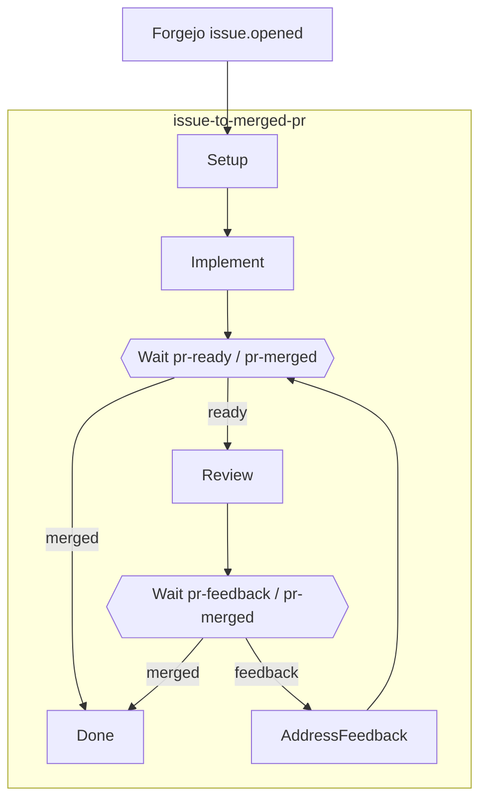
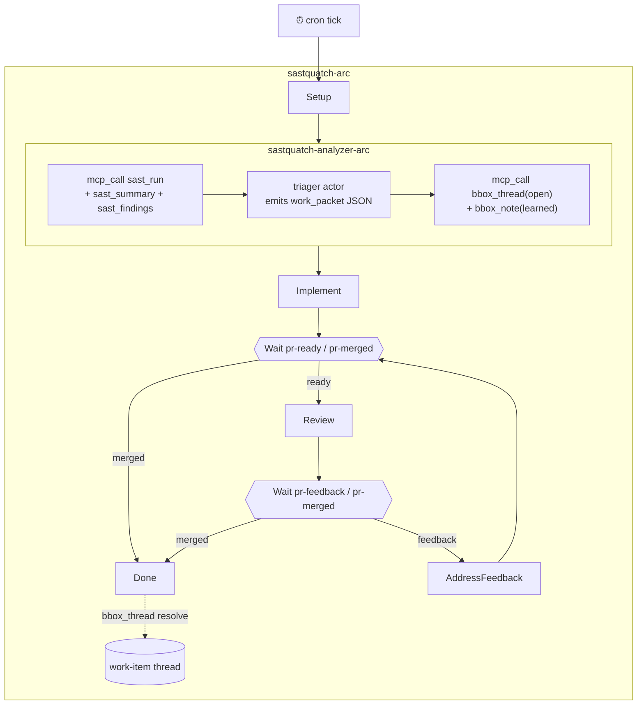

# Reference Implementations

Three end-to-end examples ship with the daemon. Each one is a complete,
runnable stack: routing packets, workflow specs, brofiles, install
scripts, and a Docker environment where needed. Copy and adapt — the
daemon doesn't read `examples/` automatically; you install what you
want.

## Keystone — issue → PR → review → merge

`examples/keystone/`

A Forgejo webhook fires on `issue.opened`. The engine dispatches an
implementer team to fix the bug and open a PR, waits on a `pr-ready`
signal, spins up a reviewer ensemble, loops on `pr-feedback` until
merged or the iteration cap is hit, then runs cleanup hooks at terminal
state.

This is the canonical workflow-engine reference: it exercises every
major primitive in one connected arc.



### What it exercises

| Feature | Where |
|---|---|
| Subworkflow composition + import/export contract | `issue-to-merged-pr.json` calls `implementer-arc` and `reviewer-arc` by id |
| `vars_schema` seeded from webhook entity | Every sub-workflow declares one |
| `${vars.x}` / `${env.X}` / `${last_signal.x}` templates | Used throughout; env carries Forgejo credentials |
| Hook ops: `set_var`, `inc_var`, `parse_json`, `worktree_create`, `worktree_remove`, `shell`, `http_json` | Setup, Wait on_exit, PushAndOpenPr, FetchDiff, PostReview, arc_exit |
| Hook gating via `when: domain:...` packet | Idempotent PR create-or-reopen, auto-merge on approve |
| `wait` with `any_of` race + `__timeout__` graceful-degrade | AwaitReviewTrigger (24 h), AwaitFeedbackOrMerge (7 d) |
| `branch` transition routing on gate verdict | Both Wait nodes |
| Workflow-level policy packet (advisor-as-packet) | Arc budget caps step count |
| Generic `http_json` for all code-host calls | Issue fetch, PR list/create, diff, review post, merge |
| `find_first` for client-side array filtering | Finds existing open PR by branch without platform search API |
| Typed correlation tuples | Two concurrent arcs on different PRs don't cross-resume |
| Poller inlet (alternative to webhook) | `pollers/forgejo-open-issues.json` (opt-in) |

### Quick start

```sh
cd examples/keystone
./scripts/run.sh                    # docker up → bootstrap → install → wait for webhook
./scripts/run.sh --dispatch         # skip webhook; dispatch arc directly against issue #1
./scripts/run.sh --skip-forgejo     # if Forgejo is already running
```

### Layout

```
examples/keystone/
├── docker-compose.yaml
├── packets/          — routing-forgejo, gate-merge-or-review, gate-loop-or-exit, …
├── webhooks/         — forgejo.json (hmac_sha256 signature scheme)
├── pollers/          — forgejo-open-issues.json (opt-in alternative)
├── workflows/        — issue-to-merged-pr, implementer-arc, reviewer-arc, …
└── scripts/          — bootstrap.sh, install.sh, run.sh
```

---

## SASTquatch — cron → SAST → fix → PR → review → merge

`examples/sastquatch/`

A calendar-driven sibling of Keystone. A daily cron tick fires the arc;
the analyzer discovers findings via biofilter's `sast_run`/`sast_summary`
MCP calls, a triager picks the highest-value cluster, a fixer applies
the fix and opens a PR, a reviewer ensemble votes, and the arc
auto-merges on approval.

SASTquatch inverts three Keystone axes simultaneously — cron vs. webhook
trigger, analyst-discovered vs. operator-supplied input, triager actor
vs. none — each inversion forcing a new engine primitive.



### What it exercises

| Feature | Where |
|---|---|
| Cron inlet (calendar-driven, no upstream event) | `crons/sastquatch-daily.json`, `concurrency: 1` (skip ticks while in-flight) |
| `mcp_call` op (engine-level outbound MCP) | Analyzer fires `sast_run` / `sast_summary` on biofilter (stdio MCP); arc hooks call `bbox_thread` / `bbox_note` on blackbox-self (HTTP MCP) |
| `triager` actor kind | `PickCluster` — emits structured JSON; `parse_json on_exit` enforces the contract |
| Work-item thread as typed envelope | Analyzer opens `bbox_thread(kind=work_item)`, threads `thread_id` through every sub-arc |
| Subworkflow composition (5 specs) | Analyzer, fixer, reviewer, feedback sub-arcs |
| Hook-only nodes (no LLM dispatch) | Setup, RunSast, OpenWorkItem, FetchDiff, PushAndOpenPr, PostReview, Done |
| `wait` nodes with typed correlation | Two concurrent arcs on different PRs don't cross-resume |
| SAST-regression guard | Fixer's `on_exit` re-runs `sast_run`; result in `vars.sast_after_fix` for downstream |

### Prerequisites

Same as Keystone, plus biofilter MCP server registered in `~/.bro/mcp.json`.
Verify: `curl -s http://127.0.0.1:7264/mcp ... | jq '.result.tools[] | select(.name | startswith("mcp__plugin_biofilter"))'`

### Quick start

```sh
cd examples/sastquatch
./scripts/run.sh --soon     # rewrites cron to fire in ~30s; waits for tick
./scripts/run.sh --dispatch # immediate arc against the seeded crate, no cron wait
./scripts/run.sh            # 9am daily schedule
```

### Layout

```
examples/sastquatch/
├── docker-compose.yaml
├── crons/         — sastquatch-daily.json (concurrency=1)
├── packets/       — routing-cron, routing-webhook, hook-when-has-work-item
├── webhooks/      — sastquatch.json (PR event extractor)
├── workflows/     — sastquatch-arc, analyzer-arc, fixer-arc, reviewer-arc, feedback-arc
└── scripts/       — bootstrap.sh (seeds buggy Rust crate + sast-bridge.json), install.sh, run.sh
```

---

## Agentic Corpus — producer machinery

`examples/agentic-corpus/`

Workflows, packets, brofiles, and crons that drive the daemon's own
knowledge-maintenance arcs: auto-digesting sessions into knowledge
candidates, proposing entity edges, detecting contradictions, and
compacting the embedding index.

These are the artifacts the daemon ships as sane defaults. They are
functional but several depend on engine primitives still in progress
(see the `examples/agentic-corpus/README.md` status section).

### Workflows

| Workflow | Purpose |
|---|---|
| `auto-digest-arc.json` | Distill a session into knowledge candidates via `digest-extractor` brofile, gate via entry-quality packet |
| `auto-edge-arc.json` | Propose knowledge↔knowledge / knowledge↔file edges via vote panels |
| `contradiction-review-arc.json` | Open a whiteboard, dispatch three specialist brofiles, synthesize a verdict |
| `embed-compaction-arc.json` | Re-embed + WAL compaction sweep |
| `schema-migration-arc.json` | Drain compaction targets after a schema bump |
| `project-bootstrap-arc.json` | Stub fired by `bbox_project_register` (stub — chunking wired in the reindex thread) |

### Brofile panels

- **Auto-digest**: `digest-extractor`
- **Auto-edge** DESCRIBES vote: `describe-narrative-cohesion`, `describe-prose-signal`, `describe-symbol-fit`
- **Auto-edge** REFERENCES vote: `reference-citation-precision`, `reference-context-fit`, `reference-target-existence`
- **Contradiction-review**: `contradiction-coherence`, `contradiction-lifecycle`, `contradiction-provenance` (specialists) + `contradiction-facilitator` (synthesizer)

### Install

The daemon does not auto-install these on startup. Install what you want:

```
bbox_artifact_install(kind="workflow", source="examples/agentic-corpus/workflows/auto-digest-arc.json")
bbox_artifact_install(kind="packet",   source="examples/agentic-corpus/packets/auto-digest/entry-quality.json")
bro_cron_install(spec=<contents of examples/agentic-corpus/crons/embed-compaction-nightly.json>)
```

Use `bbox_artifact_list` to inspect what's installed.

---

## Workflow pattern catalog

`examples/workflows/`

Minimal standalone workflow specs that demonstrate individual engine
primitives. Use as copy-paste starting points before reaching for a full
example like Keystone.

| File | Pattern |
|---|---|
| `e2e-smoke.json` | Two-turn durable actor, prompt substitution |
| `e2e-gated.json` | Gate packet + `branch` transition |
| `e2e-async-review.json` | `fork` + `fire_and_forget` + `late_inject` |
| `e2e-composition.json` | Sub-workflow as a node |
| `e2e-policy.json` | Workflow-level policy packet |
| `e2e-fork-join.json` | Fork + join fan-out/fan-in |
| `e2e-ensemble-vote.json` | Ensemble broadcast + vote aggregate |
| `blind.json` | Blind-convergence deliberation pattern |
| `optimistic.json` | Optimistic-review (fire-and-steer) pattern |

## Skills

`examples/skills/`

Claude Code skill files for the `crucible`, `overmind`, and `takeover`
orchestration patterns. Install via Claude Code's skill registration.
