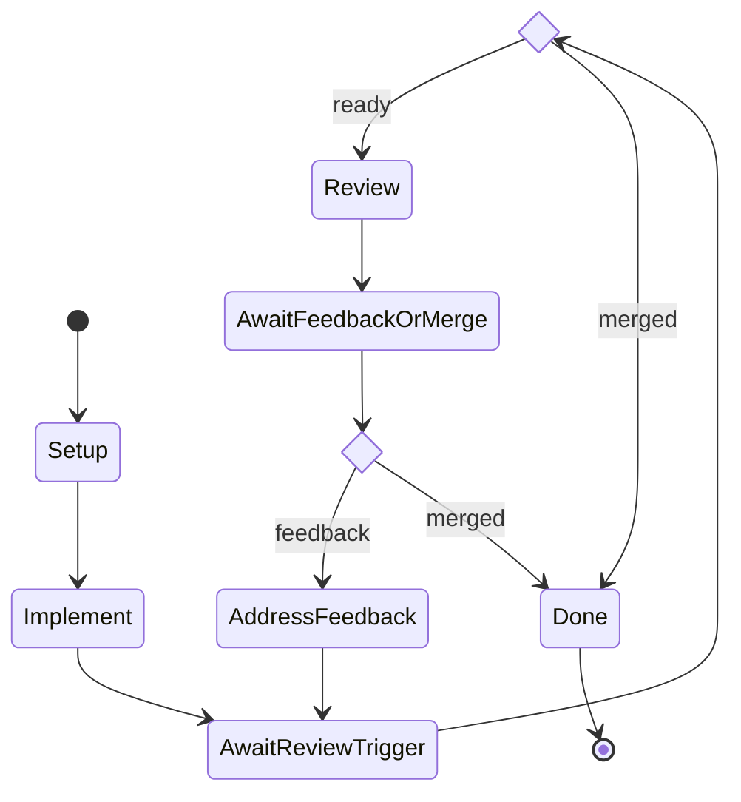

# Keystone — issue → PR → review → merge arc

End-to-end demonstration of the workflow engine. A Forgejo webhook
fires on issue-opened. The arc dispatches an implementer team to fix
the bug and open a PR, suspends on a `Wait` for the PR-ready signal,
dispatches a reviewer ensemble that posts feedback, loops on
`pr-feedback` until merged or max-iterations reached, then runs
operator-blessed cleanup hooks at terminal state.

This README is a *reference* + *adaptation guide*: read it to
understand what's wired here, then customize for your stack. For the
underlying engine semantics see [`../../WORKFLOWS.md`](../../WORKFLOWS.md).

## What it exercises

| Engine feature                                                                  | Where in this example                                                     |
|---------------------------------------------------------------------------------|---------------------------------------------------------------------------|
| Workflow + subworkflow_ref composition                                          | `workflows/issue-to-merged-pr.json` calls `implementer-arc` and `reviewer-arc` by id |
| Subworkflow imports/exports contract                                            | Implementer exports `pr_number`/`branch`; parent threads them (incl. `worktree_path`) into AddressFeedback |
| `vars_schema` declaration + initial seeding from webhook                        | Every workflow declares one; webhook routing seeds via entity merge        |
| Template heads `${vars.x}` / `${outputs.x}` / `${meta.x}` / `${last_signal.x}` / `${env.X}` | Used everywhere; `${env.FORGEJO_*}` carries credentials into `http_json` URLs/headers |
| Hooks: `set_var` / `inc_var` / `parse_json` / `worktree_create` / `worktree_remove` / `shell` / `http_json` | Setup, AwaitFeedbackOrMerge, PushAndOpenPr, FetchDiff, PostReview, on_arc_exit |
| Hook gating via `when: domain:...` packet                                       | PushAndOpenPr (idempotent create-or-reopen), PostReview (auto-merge on approve), on_arc_exit cleanup |
| Wait nodes with `any_of` race + timeout                                         | AwaitReviewTrigger (24h), AwaitFeedbackOrMerge (7d)                        |
| Synthetic `__timeout__` signal as graceful-degrade path                         | Both Wait gates accept it (route → halt)                                   |
| Choice nodes routing graph branches by gate verdict                             | `ReviewOrDone` consumes `merge-or-review`, `FeedbackOrDone` consumes `loop-or-exit` |
| Gate packets routing on `last_signal.name`                                      | merge-or-review, loop-or-exit                                              |
| Workflow-level policy packet (advisor-as-packet)                                | arc-budget caps step count                                                 |
| Domain-shaped packet refs (`domain:...`)                                        | Every gate/policy/hook-when reference                                      |
| Operator-blessed registries (workflows, webhooks, packets) persisted to disk    | All artifacts installed via `/admin/*` endpoints in `scripts/install.sh`   |
| Webhook ingress with generic `hmac_sha256` signature scheme                     | `webhooks/forgejo.json` (operator names header `X-Gitea-Signature`)        |
| Routing packet → start_arc / signal_arc / ignore                                | `packets/routing-forgejo.json` (operator's mapping; engine knows nothing of forgejo) |
| Webhook `default_project_dir` resolution                                        | Set in `webhooks/forgejo.json`; arcs created from the hook anchor here     |
| Capability tags (no-op here — every actor's `requires` is empty)                | Demonstrates the slot; populate it when picking models with hard requirements |
| Noop actor for hook-only nodes                                                  | `Setup`, `PushAndOpenPr`, `FetchDiff`, `PostReview`, `Done` — fire hooks, no LLM dispatch |
| Generic `http_json` for any code-host integration                               | Issue fetch, PR list, PR create, PR diff (via `response_kind: text`), review post, merge — same op for all |
| Generic `find_first` for client-side array filtering                            | `PushAndOpenPr` GETs ALL open PRs (Forgejo's `head=` filter is unreliable), then `find_first { from: ${vars.all_open_prs}, where: { "head.ref": "${vars.branch}" } }` writes the matching PR (or null) into `vars.existing_pr`. Composable primitive — no platform-specific search op needed. |
| Idempotent re-dispatch                                                          | `PushAndOpenPr` reuses a matching open PR (via `set_var pr_data = ${vars.existing_pr}` gated by `domain:hook-when/has-existing-pr`) instead of paving the prior arc's PR. Re-running an arc on the same issue+branch is safe. |
| Auto-merge on approval                                                          | `reviewer-arc.PostReview` fires `http_json` POST `/merge` gated by `domain:hook-when/should-merge` (verdict-as-data from aggregator) — the merge fires `pull_request closed merged:true` webhook → `pr-merged` signal → arc terminates clean without manual intervention. |

## Prerequisites

- Docker (or Podman with `alias docker=podman`)
- `jq`, `curl`, `git`, `python3` (for HMAC signature when you replay manually)
- `blackboxd` running (default port `7264`; the dev daemon at `7265` works too — see `BBOX_PORT`)
- Daemon listener bound to `0.0.0.0` so the Docker'd Forgejo can deliver webhooks. The shipped `deploy/blackbox-dev.service` already does this; the prod template is loopback by default. See [`../../WORKFLOWS.md` § Operator-blessed registries](../../WORKFLOWS.md#operator-blessed-registries).
- Daemon environment must include:
  - `FORGEJO_BASE_URL`, `FORGEJO_TOKEN` — for the implementer/reviewer to call the Forgejo API
  - `FORGEJO_WEBHOOK_SECRET` — for the daemon to verify inbound webhook signatures

  Add via systemd drop-in (`~/.config/systemd/user/blackbox-dev.service.d/keystone-secrets.conf`) or whatever envsetup pattern your daemon uses. `scripts/bootstrap.sh` writes the values to `.env`; copy them into the drop-in.
- Brofiles configured. The shipped install creates two:
  - `keystone-impl`   → Claude Sonnet 4.6
  - `keystone-review` (×2 instances `keystone-review` + `keystone-review-b`) → Claude Haiku 4.5

  Override at install time:
  ```sh
  IMPL_BROFILE=my-strong-coder \
  REVIEWER_BROFILE_A=my-haiku-a REVIEWER_BROFILE_B=my-haiku-b \
    ./scripts/install.sh
  ```
  Or edit `workflows/implementer-arc.json` + `workflows/reviewer-arc.json` to reference whatever brofile names you've already configured. **Capability validation refuses to start the arc** if a brofile resolves to a provider that doesn't cover the actor's `requires` set; today the arcs declare empty `requires` so any provider works.

## Quick start

```sh
cd examples/keystone
./scripts/run.sh                    # full path: docker up → bootstrap → install → wait
./scripts/run.sh --dispatch         # skip webhook wait; dispatch arc directly against issue #1
./scripts/run.sh --skip-forgejo     # if Forgejo is already up + bootstrapped
```

## Layout

```
examples/keystone/
├── docker-compose.yaml          # Forgejo single-instance, loopback-only
├── scripts/
│   ├── bootstrap.sh             # admin user, API token, repo, seed bug, webhook config
│   ├── install.sh               # compile packets, install brofiles/teams/workflows/webhook
│   └── run.sh                   # docker up → bootstrap → install → wait | --dispatch
├── packets/
│   ├── routing-forgejo.json            # webhook event → routing verdict
│   ├── gate-merge-or-review.json       # AwaitReviewTrigger gate
│   ├── gate-loop-or-exit.json          # AwaitFeedbackOrMerge gate
│   ├── cleanup-policy.json             # keep-on-fail / delete-on-success
│   ├── policy-arc-budget.json          # arc-level budget guard
│   ├── hook-when-no-existing-pr.json   # PushAndOpenPr: gate POST /pulls when no open PR matches branch
│   ├── hook-when-has-existing-pr.json  # PushAndOpenPr: gate "reuse pr_data from find_first match" when one does
│   └── hook-when-should-merge.json     # PostReview: gate POST /merge when aggregator verdict is "merge"
├── webhooks/
│   └── forgejo.json             # extractor + signature scheme + routing packet ref
└── workflows/
    ├── implementer-arc.json          # subworkflow: fetch issue → fix → push → open PR
    ├── implementer-feedback-arc.json # subworkflow: revise based on review feedback → push
    ├── reviewer-arc.json             # subworkflow: review PR → post comment + verdict
    └── issue-to-merged-pr.json       # main keystone arc
```

## Walkthrough

### What happens when the webhook arrives

1. Forgejo POSTs `issues.opened` to `http://172.17.0.1:7265/webhook/forgejo` with `X-Gitea-Event: issues` + `X-Gitea-Signature: <hex>`.
2. Daemon verifies the HMAC against `${FORGEJO_WEBHOOK_SECRET}`.
3. Idempotency dedup against the `X-Gitea-Delivery` UUID (resends are dropped silently).
4. **Extractor** projects the body + headers into a flat entity:
   ```jsonc
   { "event": "issues", "action": "opened",
     "issue_number": 42, "issue_title": "...",
     "owner": "keystone-admin", "repo": "transcript-search-fork", ... }
   ```
5. **Routing packet** (`domain:webhook-routing/forgejo`) classifies → `start_arc` verdict with `workflow: "issue-to-merged-pr"`.
6. Daemon merges the extracted entity into `initial_vars` and spawns the arc with `project_dir = WebhookSpec.default_project_dir = /tmp/keystone-fork-clone`.

### What the arc does



| Node                | Kind                       | What happens                                                                 |
|---------------------|----------------------------|------------------------------------------------------------------------------|
| `Setup`             | Noop + on_enter hooks      | Initialize counter vars, derive branch name, `WorktreeCreate`, capture `worktree_path` into vars for sub-arcs. |
| `Implement`         | subworkflow_ref            | Runs `implementer-arc`: `http_json` GET issue → LLM edits + commits → `shell` push → idempotent `http_json` POST/PATCH PR. Exports `pr_number`/`branch`. |
| `AwaitReviewTrigger`| Wait `any_of [pr-ready, pr-merged]`, 24h timeout, `gate: merge-or-review` | Suspends until pr-ready or pr-merged; gate emits `ready`/`merged` verdict. |
| `ReviewOrDone`      | `<<choice>>`               | Routes by gate verdict: `ready` → Review, `merged` → Done.                  |
| `Review`            | subworkflow_ref            | Runs `reviewer-arc`: `http_json` GET diff (`response_kind: text`) → ensemble reviewers emit verdicts → single-actor aggregator emits `{event, body, action: "merge"\|"request_changes"}` JSON → PostReview parses, posts COMMENT, and `http_json` POST `/merge` gated by `should-merge`. |
| `AwaitFeedbackOrMerge` | Wait `any_of [pr-feedback, pr-merged]`, 7d timeout, `gate: loop-or-exit` | Suspends; `on_exit` captures last_signal payload + increments `review_iteration`. Gate emits `merged`/`feedback`/`halt`. |
| `FeedbackOrDone`    | `<<choice>>`               | Routes by gate verdict: `feedback` → AddressFeedback, `merged` → Done.       |
| `AddressFeedback`   | subworkflow_ref            | Runs `implementer-feedback-arc`: revise + commit → on_exit `shell` push → fires `pull_request.synchronize` webhook → loops back to AwaitReviewTrigger. |
| `Done`              | Noop                       | Terminal node. Triggers `on_arc_exit` hooks at workflow level. |

`on_arc_exit` runs `WorktreeRemove` gated by `domain:workflow-cleanup/keep-on-fail` — keeps the worktree when `meta.arc_outcome` ∈ {`failed`, `cancelled`, `timeout`}, deletes on success.

### What the implementer / reviewer LLMs actually do

LLMs do cognitive work only. Mechanical pieces (HTTP calls, git operations, JSON parsing, idempotency, gating) are workflow JSON composing the engine's generic ops. The engine knows nothing about Forgejo.

The implementer (`workflows/implementer-arc.json`):

1. **FetchIssue.on_enter hooks** (mechanical):
   - `http_json` GET `${env.FORGEJO_BASE_URL}/api/v1/repos/${vars.owner}/${vars.repo}/issues/${vars.issue_number}` with bearer auth from `${env.FORGEJO_TOKEN}` → response captured into `vars.issue_data`.
   - `set_var` extracts `vars.issue_title` / `vars.issue_body` from `${vars.issue_data.*}`.
   - `set_var` derives `vars.branch = "fix/issue-${vars.issue_number}"`.
2. **FetchIssue prompt** (LLM): edit files in `${vars.worktree_path}` on `${vars.branch}` to fix the issue, commit. Do NOT push or open PR — that's mechanical.
3. **PushAndOpenPr** (Noop with hooks — idempotent re-dispatch):
   - `shell` `git push -u origin ${vars.branch}` (cwd=`${vars.worktree_path}`).
   - `http_json` GET `pulls?state=open&limit=50` → `vars.all_open_prs`. Forgejo's `head=` query filter is broken in some versions, so we fetch the open set and filter client-side.
   - `find_first { from: ${vars.all_open_prs}, where: { "head.ref": "${vars.branch}" } }` → `vars.existing_pr` (PR object or null).
   - `http_json` POST `/pulls` (gated by `domain:hook-when/no-existing-pr`) → `vars.pr_data` — fires only when no open PR matches.
   - `set_var pr_data = ${vars.existing_pr}` (gated by `domain:hook-when/has-existing-pr`) — reuses the matching PR otherwise.
   - `set_var pr_number = ${vars.pr_data.number}` (always — both paths populate `pr_data`).

The reviewer (`workflows/reviewer-arc.json`):

1. **FetchDiff.on_enter** (mechanical): `http_json` GET `pulls/${vars.pr_number}.diff` with `response_kind: text` → `vars.pr_diff`.
2. **Review node** (ensemble of two reviewers): each gets the diff in their prompt, returns one line: `APPROVE` or `REQUEST CHANGES: <reason>`.
3. **Aggregate node** (single executor — must be single, not ensemble, so the JSON output is a single document not a merged blob): emits strict JSON `{event: "COMMENT", body, action: "merge"|"request_changes"}`. `event` is always COMMENT because Forgejo refuses APPROVED/REQUEST_CHANGES on a self-authored PR (single-user demo).
4. **PostReview** (Noop with hooks):
   - `parse_json ${Aggregate.output}` → `vars.review_payload`.
   - `http_json` POST `/pulls/${vars.pr_number}/reviews` with the comment body.
   - `http_json` POST `/pulls/${vars.pr_number}/merge` **gated by `domain:hook-when/should-merge`** (`vars.review_payload.action == "merge"`) — fires `pull_request closed merged:true` webhook → routes to `pr-merged` signal → AwaitFeedbackOrMerge resolves on merged → arc terminates clean.

The feedback-loop subworkflow (`workflows/implementer-feedback-arc.json`) runs in the SAME worktree on the SAME branch — the implementer addresses feedback + commits, on_exit `shell` push fires `pull_request.synchronize` → resumes the parent on `pr-ready`.

## Live observation

```sh
# stream every event the engine emits (SSE)
curl -N http://127.0.0.1:7265/tail

# all in-flight arcs with current node + completed nodes + visit counts
curl http://127.0.0.1:7265/orchestrate/peek | jq

# arc-specific note trail (audit) + latest compaction anchor
bro orchestrate status <arc_thread_id>

# replay a webhook payload through extractor + routing packet WITHOUT
# dispatching — debugging gold for routing rule iteration
curl -X POST -H 'Content-Type: application/json' \
     -H 'X-Gitea-Event: issues' \
     -d '{"action":"opened","issue":{"number":42,"title":"x"},
          "repository":{"name":"r","owner":{"login":"o"}}}' \
     http://127.0.0.1:7265/webhook/forgejo/replay | jq
```

## Customization

### Adapting to a different code-host (GitHub instead of Forgejo)

1. **Extractor** — GitHub puts the event type in `X-GitHub-Event` instead of `X-Gitea-Event`. Edit `webhooks/forgejo.json` (rename to `webhooks/github.json` for clarity), change the `event` selector path to `$._headers.x-github-event`. Most other paths (`$.action`, `$.issue.number`, `$.pull_request.number`) are identical.
2. **Signature** — Keep `signature.kind: hmac_sha256`; change `header` to `X-Hub-Signature-256` and add `prefix: "sha256="`. Secret env name is operator-controlled.
3. **API calls** — Forgejo and GitHub diverge on the `pulls` endpoint shape. All API calls in this example are `http_json` hooks templated against `${env.FORGEJO_BASE_URL}` + `${env.FORGEJO_TOKEN}`; for GitHub, set `${env.GITHUB_BASE_URL}=https://api.github.com` (or a per-host env var of your choice) and adjust the path templates in the workflow JSON. No engine changes required.
4. **Routing packet** — keep the rule shapes; only `event` value matchers change in some edge cases (`pull_request_review` event has `action: "submitted"` on both — no change needed).

### Adapting to a different code-fix shape (not "fix a bug")

The keystone is a *fix-this-issue* arc, but the same skeleton works for:

- **Triage** arcs — replace `Implement` with a subworkflow that classifies the issue + adds labels via Forgejo API. No PR; arc terminates after the triage decision.
- **Spec authoring** arcs — `Implement` writes a design doc commit to a branch; reviewer proposes shape changes in PR comments; merge-on-approval.
- **Dependency update** arcs — `Implement` runs `cargo update` + `cargo test`; PR contains the lockfile diff.

The shape constant: webhook → extract → route → start_arc → subworkflow → wait-on-PR-event → loop until terminal verdict → cleanup.

### Adapting to a different model stack

Edit `workflows/*.json` `actors[*].brofile` (or pass `IMPL_BROFILE=` / `REVIEWER_BROFILE_A=` to `install.sh`). If the actor needs structured output, declare:

```jsonc
"actors": {
  "structured_review": {
    "kind": "ensemble",
    "team": "review-team",
    "requires": ["structured_output"]
  }
}
```

Capability validation will refuse to install/dispatch the arc if any team member's brofile resolves to a provider lacking that capability — see [`WORKFLOWS.md` § Capability tags](../../WORKFLOWS.md#capability-tags).

### Adapting the loop semantics

Concrete tweaks you'll likely want:

- **Concurrent arcs on different PRs.** Today both `Wait` nodes correlate on `{}` (broadcast match). For multi-arc concurrency, change to `{ "pr": "${vars.pr_number}" }` so a `pr-merged` for PR #117 only resumes the arc waiting on PR #117. Routing packet's signal_arc verdict needs to extract `pr_number` from the entity into `correlate` too — currently it ships `correlate: {}`.
- **Push-storm debouncing.** Three commits to the PR fire three `pull_request.synchronize` webhooks → three `pr-ready` signals → three reviewer dispatches. Add a `vars.review_in_progress` flag in `Review`'s `on_enter`/`on_exit`, then add a routing rule that ignores `synchronize` events while it's set. Pattern documented in [`WORKFLOWS.md` § Webhook ingress](../../WORKFLOWS.md#webhook-ingress); not wired here for clarity.
- **Different cleanup policy.** Edit `packets/cleanup-policy.json`. Three options ship as templates:
  - `keep-on-fail` (default here) — keep worktree for failed/cancelled/timeout, delete on success
  - `always-delete` — change the rule to fire-default on any outcome
  - `always-keep` — invert
- **Different arc budget.** Edit `packets/policy-arc-budget.json`. Today: warn at step 50, halt at step 100.
- **Different max-iterations on the feedback loop.** Edit `workflows/issue-to-merged-pr.json` Setup hooks — `set_var max_iterations 5` is the only knob. Beyond 5 review rounds, `gate-loop-or-exit.json` halts the arc.

### Adding a new actor

1. Pick a `kind` (`executor` / `ensemble` / `advisor` / `user` / `noop`).
2. Reference an existing brofile (or upsert a new one via `/admin/brofile/upsert` or `bro_brofile`).
3. Add to `actors` in the appropriate workflow spec.
4. Reference from a node via `actor: <name>`.
5. If it has hard provider requirements, declare `requires: [Capability,...]`.

### Adding a new hook op

The op catalog is in `src/workflow/ops.rs`. Add a variant to `OpKind` + a handler function + a test. Update [`WORKFLOWS.md` § Op catalog](../../WORKFLOWS.md#op-catalog-current) when you do.

For most external API calls, `http_json` is the primitive: workflow author writes the URL/headers/body as templates over `${env.X}` (credentials, base URLs) and `${vars.X}` (workflow state); the response lands in `vars[into_var]` for downstream templates. The engine carries no platform-specific knowledge — adapting to GitHub, GitLab, Gitea, Bitbucket, or anything else is a workflow JSON change, not a code change.

### Adding a new webhook source

1. Write an extractor projecting the source's payload shape into a flat entity matching whatever your workflow's `vars_schema` expects.
2. Write a routing packet whose rules emit JSON-encoded `start_arc` / `signal_arc` consequents.
3. Pick a signature scheme (HMAC-SHA256 supported as `forgejo` or `github`; pure-loopback testing accepts `none`).
4. Set `default_project_dir` if any arcs the webhook spawns will use `WorktreeCreate`.
5. Install via `bro_webhook_install` or `POST /admin/webhook/install`; persisted to `${BRO_HOME}/webhooks/<name>.json` and restored on daemon restart.

## Tear-down

```sh
docker compose down -v          # wipes Forgejo data
rm -f .env                       # admin token + webhook secret per-host

# Daemon-side state (workflows + webhooks + compiled packets) persists.
# Remove via:
bbox_forget <packet-id>          # or POST /admin/... — bro_workflow_uninstall
                                 # / bro_webhook_uninstall don't exist yet;
                                 # rm the on-disk JSON files for now:
rm ~/.local/state/blackbox/bro/{webhooks,workflows}/*.json
systemctl --user restart blackbox.service   # picks up the deletion
```

## Known gaps + watch points

| Gap                                    | Impact                                                                 | Fix sketch                                            |
|----------------------------------------|------------------------------------------------------------------------|-------------------------------------------------------|
| Webhook correlation = `{}` (broadcast) | Two concurrent arcs on different PRs would cross-resume each other's waits | Change `correlate` to `{pr: "${vars.pr_number}"}` AND have routing extract `pr_number` into both the verdict and each `WaitSpec.correlate`. The single-issue demo never trips this; multi-issue concurrency does. |
| Push-storm not debounced               | N commits → N `pull_request.synchronize` events → N reviewer dispatches  | `vars.review_in_progress` flag + routing-rule guard (see `WORKFLOWS.md` § Webhook ingress) |
| PR reuse only handles open PRs         | A closed-but-unmerged PR for the same head will conflict on POST → halt. The `state=open&limit=50` GET also doesn't paginate. | Either paginate + scan all PRs (need `find_first` over multiple pages, or a follow-up `find_all` op) OR widen to `state=all` and add a PATCH-reopen branch — the workflow is already wired to handle either via packet gating. |
| `Shell` op has no allowlist enforcement| Trusted-actor assumption                                                | Wire shell-policy packet (design in `WORKFLOWS.md`)   |
| `cancel_arc` routing verdict           | Webhook can't terminate a running arc                                   | Engine cancellation primitive (phase-next)            |
| `bro_workflow_uninstall` / `bro_webhook_uninstall` don't exist | Tear-down requires `rm` + restart                       | Add inverse MCP tools + matching `/admin/` endpoints  |
| `WaitStore` is in-memory only          | Daemon restart loses every suspended arc                                | Disk-back: serialize on register, drop on resolve     |
| Real LLM dispatch every run            | Burns tokens. No simulator mode                                         | `--dry-run` validates spec only; for actor simulation, a `simulator` actor kind is phase-next |
| Self-review COMMENT event              | Forgejo refuses APPROVED / REQUEST_CHANGES on a self-authored PR. The aggregator emits `event: COMMENT` with the verdict in the body so single-user demos work; on a multi-user host you can switch to APPROVED / REQUEST_CHANGES. | Aggregator prompt + downstream routing on `pull_request_review.{approved,rejected}` events. |
