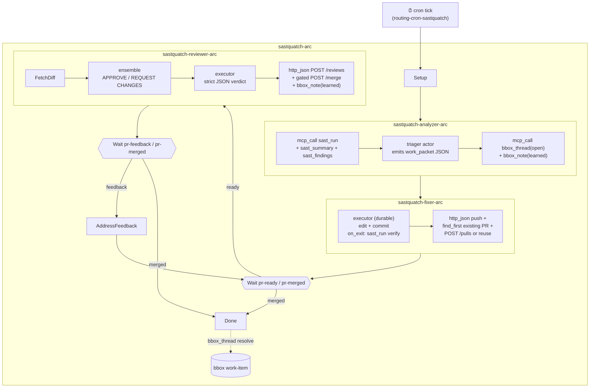

# SASTquatch — cron → SAST → fix → PR → review → merge arc

Companion to [keystone-arc](../keystone/README.md). Same backbone — sub-
workflow composition, gated branches, ensemble review, idempotent PR
mechanics, auto-merge on approval — but inverted in three ways at once
to exercise primitives keystone doesn't:

| Axis            | Keystone                           | SASTquatch                                    |
|-----------------|------------------------------------|-----------------------------------------------|
| **Trigger**     | Webhook (issue-opened)             | Cron (calendar-driven, no upstream event)     |
| **Input shape** | Operator-supplied issue body       | Analyst-discovered (analyzer arc grounds itself via `mcp_call → sast_run`) |
| **Selector**    | None (one issue → one arc)         | `triager` actor — picks next-most-useful cluster from N findings |

Each inversion forced a new primitive. SASTquatch is what those
primitives look like working end to end.

## What it exercises

| Engine feature | Where in this example |
|----------------|------------------------|
| **Cron inlet** (calendar trigger; sibling of webhook + poller) | `crons/sastquatch-daily.json` — 6-field cron expr, `concurrency: 1` cap (skip ticks while previous arc in flight), synthetic `cron_name` + `tick_at` entity fields merged at tick time |
| **`mcp_call` op** (engine-level outbound MCP client) | Analyzer fires `sast_run` / `sast_summary` / `sast_findings` on biofilter (stdio MCP). Fixer re-runs `sast_run` on its branch before opening the PR. Analyzer + reviewer + arc-exit hooks call `bbox_thread` / `bbox_note` on the blackbox-self HTTP MCP. No bro dispatch needed for grounding. |
| **`triager` actor kind** (selection actor — same dispatch as executor, distinct contract) | `sastquatch-analyzer-arc.PickCluster` — emits structured JSON describing the cluster to attack. `parse_json` on `on_exit` enforces the contract before downstream nodes consume it. |
| **Work packet via bbox work-item thread** (typed envelope, not free-form JSON) | Analyzer opens a `bbox_thread(kind=work_item)`, captures `thread_id` into vars, threads it through every sub-arc. Fixer + reviewer + arc-exit append structured `bbox_note`s under the thread. Audit trail accumulates against the work-item, not the dispatched bro session. |
| Cron concurrency gate (skip ticks while in-flight) | `concurrency: 1` in the spec; cron loop checks via `state.crons.try_claim` before dispatching, decrements on terminal exit |
| Subworkflow composition (5 specs) | `sastquatch-arc.json` calls analyzer, fixer, reviewer, feedback by `subworkflow_ref`. Each sub declares its own `vars_schema` + `actors`. |
| Hook-only nodes (empty `actor`) | Setup, RunSast, OpenWorkItem, FetchDiff, PushAndOpenPr, PostReview, Done — fire hooks, no LLM dispatch |
| `wait` nodes with typed correlation | AwaitReviewTrigger / AwaitFeedbackOrMerge correlate on `vars.pr_number` via `Selector{json_path: "vars.pr_number"}` so two concurrent SASTquatch arcs (one for `quat`, one for `quat-other`) don't cross-resume |
| Routing packet → start_arc / signal_arc / ignore | `packets/routing-cron-sastquatch.json` (cron → start_arc) and `packets/routing-webhook-sastquatch.json` (PR events → signal_arc) — same dispatch_routed_event convergence as keystone uses |
| Auto-merge on approval | Reviewer aggregator emits `{action: "merge"|"request_changes"}`; PostReview fires `http_json POST /merge` gated by `domain:hook-when/should-merge`; merge fires `pull_request closed merged:true` webhook → `pr-merged` signal → arc terminates |
| SAST-regression guard | Fixer's `on_exit` re-runs `sast_run` on the post-fix worktree. Today this captures the result into `vars.sast_after_fix` for downstream visibility — wiring a packet that fails the node on regression is the next step (see "Future work" below). |

## Prerequisites

Same as keystone, plus:

- **biofilter MCP server** registered in `~/.bro/mcp.json`. The plugin
  ships at `~/.claude/plugins/cache/daystrom/biofilter/<version>/`; if
  it's already in your Claude/Codex MCP config, the sastquatch-daemon
  sees it because `bro_mcp` reads the same registry. Verify with:
  ```sh
  curl -s http://127.0.0.1:7264/mcp -d '{"jsonrpc":"2.0","method":"tools/list","id":1}' \
    | jq '.result.tools[] | select(.name | startswith("mcp__plugin_biofilter"))'
  ```
- The seed crate's SAST toolchain inside the bootstrap container —
  `cargo`, `clippy`, `clippy-sarif`, `cargo-audit`, `python3` — has to be
  reachable from the worktree the fixer runs in. The default install
  assumes the host has these installed (the fixer agent's worktree
  inherits the host PATH).
- **Three brofiles**:
  - `sastquatch-triager` → Claude Sonnet 4.6 (Opus 4.7 also fine — the
    triager benefits from stronger judgement on cluster selection)
  - `sastquatch-fixer` → Claude Sonnet 4.6 (durable + compaction_anchor)
  - `sastquatch-review` → Claude Haiku 4.5 (×2 reviewer team)

## Quick start

```sh
cd examples/sastquatch
./scripts/run.sh --soon          # docker up → bootstrap → install w/ ~30s cron → wait for tick
./scripts/run.sh --dispatch      # skip cron entirely; immediate arc against the seeded crate
./scripts/run.sh                 # default: install canonical 9am-daily cron, wait
./scripts/run.sh --skip-forgejo  # if container + bootstrap already done
```

`--soon` rewrites the cron's schedule field to a one-shot fires-in-30s
expression at install time so the e2e walks without overnight waiting.

## Layout

```
examples/sastquatch/
├── docker-compose.yaml                # Forgejo on :3100 (keystone uses :3000 — runs side by side)
├── crons/
│   └── sastquatch-daily.json          # 6-field cron expr, concurrency=1, routing_packet ref
├── webhooks/
│   └── sastquatch.json                # PR-event extractor (no issues.opened — different from keystone)
├── packets/
│   ├── routing-cron-sastquatch.json   # cron-name → start_arc verdict
│   ├── routing-webhook-sastquatch.json# PR open/synchronize → pr-ready, closed merged:true → pr-merged, review/comment → pr-feedback
│   └── hook-when-has-work-item.json   # gates the bbox_thread(resolve) call on Done
├── workflows/
│   ├── sastquatch-arc.json            # top-level: setup → analyze → fix → review-loop → merge
│   ├── sastquatch-analyzer-arc.json   # mcp_call sast_* → triager picks cluster → bbox_thread(open)
│   ├── sastquatch-fixer-arc.json      # fixer applies fix → re-runs SAST → push + open-or-reuse PR
│   ├── sastquatch-feedback-arc.json   # receive feedback → re-edit → re-run SAST → push
│   └── sastquatch-reviewer-arc.json   # ensemble review → aggregator JSON → gated auto-merge
└── scripts/
    ├── bootstrap.sh                   # seeds buggy Rust crate + sast-bridge.json + cargo-audit→SARIF converter
    ├── install.sh                     # registers packets, brofiles, team, workflows, webhook, cron
    └── run.sh                         # end-to-end driver
```

## Arc shape



## Ontology gaps SASTquatch closed (vs. open)

This example existed because three primitives were missing. Each
landed in its own commit before the workflows could be authored.

**Closed:**

1. **Cron as a calendar inlet, distinct from poller.** Pollers fetch
   HTTP per tick — the data rides on the tick. Crons carry no fetch;
   the data is whatever the dispatched arc goes and acquires. Bundling
   them would have meant either a no-op-fetch poller (wrong taxonomy)
   or a special case. `src/crons.rs` is its own module mirroring
   `pollers.rs` shape; both converge on `dispatch_routed_event`.
2. **`mcp_call` as a hook op.** Without it, the fixer would have to
   dispatch a bro to make every grounding call (sast_run, bbox_thread,
   bbox_note), which is expensive and non-deterministic. The op
   reaches the existing `bro_mcp` registry and supports both stdio
   (biofilter) and streamable HTTP (blackbox-self).
3. **`triager` as an actor kind.** Distinct from `executor` (does work),
   `advisor` (renders judgement), and `planner` (authors a plan):
   `triager` selects from a queue. Mechanically same as `executor` —
   the contract carries the difference. Pair with `parse_json` on
   `on_exit` to enforce structured output. The `planner` kind landed
   in the same commit for symmetry; SASTquatch v1 doesn't use it but
   the slot exists for "compose a multi-cluster plan, hand each cluster
   to a triager round" arcs.

**Still open** — SASTquatch v1 ships without these:

- **Typed work-packet envelope.** Today the work-packet is a JSON
  blob inside a `bbox_thread(kind=work_item)`. The thread_id rides
  forward, but the schema is enforced only by `parse_json` shape
  checks. A first-class `WorkPacket` type with `correlation_tuple`-
  style validation would let arcs query "all packets for file X across
  every run" without opening every thread.
- **SAST-regression gate.** `sastquatch-fixer-arc.ApplyFix.on_exit`
  captures the post-fix `sast_run` result into `vars.sast_after_fix`
  but doesn't fail the node when new findings appear. Wire a packet
  that compares against the pre-fix summary, classify by dimension,
  refuse to push when a regression appears in `soundness` or
  `resilience`.
- **Cross-arc memory.** Each cron tick gets fresh `initial_vars`. The
  triager doesn't know "we tried to fix this cluster yesterday and
  reviewers killed it." `bbox_remember` works as a side channel but
  is invisible to the arc audit trail. A per-workflow ledger of
  prior-cluster outcomes that the analyzer reads on entry is the next
  step.
- **Trinary loop verdict.** ACCEPT / REJECT-with-feedback today.
  Adding ABANDON-cluster (close PR, mark cluster as suppressed for N
  days) needs a new gate verdict + a bbox_thread mutation lane.
- **Concurrency cap that actually waits.** `concurrency: 1` skips
  ticks rather than queueing them. Adequate for daily SAST sweeps;
  hourly arcs that legitimately overlap would benefit from a bounded
  queue.

## Future work

- Replace the seed crate with the *current repo* as the SAST target,
  so SASTquatch eats its own findings while we develop the engine.
  Bootstrap would skip the seed-buggy-Rust step and clone this
  workspace into the demo.
- Add a `planner` arc upstream of `analyzer` that surveys all
  unmerged clusters across active threads and produces a triage queue
  the analyzer iterates over. Same primitives, longer arc.
- Wire the SAST-regression gate as a packet so the fixer can't push
  a fix that introduces new findings in higher-priority dimensions.
- Cross-arc state via a workflow-scoped ledger thread.

## See also

- [`../keystone/README.md`](../keystone/README.md) — issue-driven sibling
- [`../../WORKFLOWS.md`](../../WORKFLOWS.md) — engine semantics
- [`../workflows/`](../workflows/) — pattern catalog (linear, fork-join, ensemble-vote, blind-converge, …)
