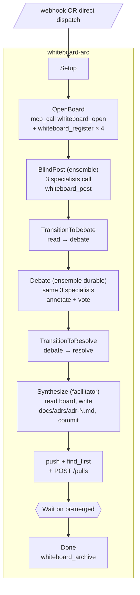

# Whiteboard — multi-agent ADR deliberation arc

Companion to [keystone](../keystone/README.md) and [sastquatch](../sastquatch/README.md). Same backbone — webhook ingress, idempotent PR mechanics, auto-merge — but the work in the middle is **structured deliberation** instead of bug-fixing or SAST-squashing. A panel of specialist agents posts blind, debates, votes, and a facilitator synthesizes the result into a markdown ADR that ships as a PR.

This is also the example that absorbs phaser into the engine. The whiteboard primitive is now first-class machinery (`whiteboard_*` MCP tools, `whiteboards` module), not an external MCP dependency.

| Axis            | Keystone           | SASTquatch                          | Whiteboard                                    |
|-----------------|--------------------|-------------------------------------|-----------------------------------------------|
| **Trigger**     | Issue webhook      | Cron (calendar)                     | ADR-tagged issue webhook                      |
| **Work shape**  | One agent fixes    | Triager picks, fixer applies        | N agents deliberate, facilitator synthesizes  |
| **Artifact**    | Bug fix            | SAST-cluster fix                    | ADR markdown                                  |
| **New primitives exercised** | (baseline) | cron / mcp_call / triager-as-executor | whiteboard / multi-round durable ensemble    |

## What it exercises

| Engine feature | Where in this example |
|----------------|------------------------|
| **Whiteboard primitive** (in-engine, port of phaser) | `whiteboard_open` / `whiteboard_register` in OpenBoard node; specialists call `whiteboard_post` from inside their dispatched turns; facilitator drives `whiteboard_transition`; `whiteboard_archive` on Done |
| **Multi-round durable ensemble** | `actors.specialists.durable: true` — same 3 specialist sessions answer BlindPost AND Debate; their context survives the phase transition without re-prompting |
| **Phase-correlated wait** (could be) | Today's arc walks transitions sequentially since the workflow itself drives them. The wait-on-phase pattern would matter when an external Claude joins mid-deliberation; documented in "ontology gaps" below |
| **mcp_call against blackbox-self** | OpenBoard, TransitionToDebate, TransitionToResolve, Done all hit `whiteboard_*` via mcp_call (HTTP transport, loopback) |
| **Three-specialist team with different lenses** | `whiteboard-spec-{security,performance,design}` brofiles, each with a persona-specific lens; team `whiteboard-specialists` broadcasts to all three |
| **Facilitator as plain executor** | `kind: executor` + `brofile: whiteboard-facilitator` — no separate "facilitator" actor kind. Persona is in the brofile lens |
| Sub-arc-free top-level | Single workflow file (no subworkflow_ref split). The deliberation IS the structure |
| Forgejo PR mechanics + auto-merge | Reused from keystone; same idempotent push + find-or-create + auto-merge pattern |

## Prerequisites

- Same as keystone: Docker, jq/curl/git, `blackboxd` (or `blackboxd-dev`) running
- Forgejo reachable at `127.0.0.1:3000` (run `examples/keystone/scripts/run.sh` first if you don't have one yet — the whiteboard demo shares it)
- **Four brofiles** auto-installed by `scripts/install.sh`:
  - `whiteboard-facilitator` → Sonnet 4.6 (synthesis-focused lens)
  - `whiteboard-spec-security` → Sonnet 4.6 (threat-modeling lens)
  - `whiteboard-spec-performance` → Sonnet 4.6 (perf-analysis lens)
  - `whiteboard-spec-design` → Sonnet 4.6 (design-coherence lens)
- Each specialist's brofile lens declares its `agent_name` so when the dispatched bro calls `whiteboard_post`, it knows which name to use

## Quick start

```sh
cd examples/whiteboard
./scripts/run.sh --dispatch          # immediate; skip the webhook wait
./scripts/run.sh                     # wired via webhook; open another ADR-prefixed issue to trigger
./scripts/run.sh --skip-bootstrap    # repo + issue + webhook already configured
```

`--dispatch` calls `/orchestrate/by-id` against the seeded issue (#1) directly, bypassing webhook routing. Useful for the e2e demo run.

## Layout

```
examples/whiteboard/
├── webhooks/whiteboard.json              # Forgejo PR + issue webhook spec
├── packets/routing-webhook-whiteboard.json
├── workflows/whiteboard-arc.json         # single top-level workflow
└── scripts/
    ├── bootstrap.sh                      # repo + ADR-request issue + webhook
    ├── install.sh                        # packets + brofiles + team + workflow + webhook
    └── run.sh                            # end-to-end driver
```

## Arc walk



## Ontology lessons this example surfaces

**Closed during this commit set:**

1. **Actor kinds collapsed to `{executor, ensemble}`.** Persona / role / contract (advisor, planner, triager, facilitator, specialist, reviewer, aggregator, …) is a workflow-author concern carried by the brofile lens + prompt + on_exit `parse_json` validation — never an engine type. The previous `advisor` / `planner` / `triager` / `user` markers didn't pull engine weight.

2. **Whiteboard is engine machinery.** Phaser was a mk0 stdio MCP. We absorbed its protocol — phases, posts, annotations, votes, conflict detection, auto-transition advisory — into `src/whiteboards.rs` and exposed it as `whiteboard_*` tools on the daemon's MCP HTTP. Phaser stays peer software; bridgecrew / isolinear / ARS keep using it until they migrate. The engine version is a superset surface in-process.

3. **Human-in-the-loop without a `user` actor.** The `user` kind was a stopgap "halt with note." With whiteboards, humans (and external Claudes) join a board as agents — same `whiteboard_*` MCP surface in-workflow ensemble specialists use. No special engine type, no escalation registry. The board IS the petition surface AND the response surface. An `operator` role is registered alongside specialists at OpenBoard time as the slot a human can take.

4. **Multi-round durable ensemble.** The same three specialist sessions answer BlindPost and Debate. Their context (what they posted, the prompt template, prior reasoning) persists across the phase transition. No re-prompting, no context-rebuild — `actor.durable: true` does the work.

**Still open** (flagged for future iterations):

- **`wait_for_phase` as a first-class wait variant.** Today the workflow drives transitions sequentially via mcp_call. If an external Claude joins mid-deliberation (operator decides to weigh in before the facilitator transitions), the arc has no way to wait for THAT transition. The `whiteboard_transition` tool already fires a routed `board-transitioned` signal; a workflow can correlate against `(board, target_phase)` using the existing `wait` primitive. Demonstrate this pattern in v2.
- **Ensemble auto-post.** Today each specialist's prompt instructs them to call `whiteboard_post` themselves. If the LLM forgets (rare but possible), the post doesn't land. Engine-driven auto-post — when the node has a `board:` field, parse each member's STRICT-JSON output and post automatically — would make the contract reliable.
- **Per-member prompt templating.** Ensemble dispatch passes the same prompt to every member. Each specialist knows its `agent_name` only via its brofile lens. A `${meta.member_name}` template variable resolved per-member would let one prompt template drive N differently-named posts without per-brofile-lens duplication.
- **Inbox surfacing of open boards.** `bbox_inbox` doesn't yet list open whiteboards as attention items. Operators would benefit from "boards waiting on facilitator transition" or "boards in resolve phase awaiting archive."

## Comparison: engine whiteboard vs. phaser

| | Phaser (mk0, external) | Engine whiteboard (this commit) |
|---|---|---|
| Transport | Stdio child process | In-process via streamable HTTP MCP |
| Storage | File-locked JSON, `proper-lockfile` | File-per-board JSON, `parking_lot` RwLock (single-daemon) |
| Concurrency | Multi-process safe (Node IPC scenario) | Single-daemon; arc + external client share same memory |
| Surface | 9 stdio tools | 10 HTTP MCP tools (same shape) |
| Restart durability | On-disk; survives restart | On-disk; survives restart |
| Integration with arc lifecycle | Workflow-author wires every call | Workflow-author wires every call (today); engine-driven hooks possible (future) |
| Audit trail | Board JSON | Board JSON + arc thread events |

## See also

- [`../keystone/README.md`](../keystone/README.md) — issue → fix → review → merge
- [`../sastquatch/README.md`](../sastquatch/README.md) — cron → SAST → fix → review → merge
- [`../../WORKFLOWS.md`](../../WORKFLOWS.md) — engine semantics, including the new Whiteboards section
