# Whiteboard — multi-agent ADR deliberation arc

Companion to [keystone](../keystone/keystone-example.md) and [sastquatch](../sastquatch/sastquatch-example.md). Same backbone — webhook ingress, idempotent PR mechanics, auto-merge — but the work in the middle is **structured multi-round deliberation** instead of bug-fixing or SAST-squashing. A panel of specialist agents posts blind, validates each other's claims against evidence, exchanges challenges and rebuttals across gated response rounds, votes only after the exchange, and a facilitator synthesizes the result (including surviving disagreements) into a markdown ADR that ships as a PR.

This is also the example that absorbs phaser into the engine. The whiteboard primitive is now first-class machinery (`whiteboard_*` MCP tools, `whiteboards` module), not an external MCP dependency.

| Axis            | Keystone           | SASTquatch                          | Whiteboard                                    |
|-----------------|--------------------|-------------------------------------|-----------------------------------------------|
| **Trigger**     | Issue webhook      | Cron (calendar)                     | ADR-tagged issue webhook                      |
| **Work shape**  | One agent fixes    | Triager picks, fixer applies        | N agents deliberate, facilitator synthesizes  |
| **Artifact**    | Bug fix            | SAST-cluster fix                    | ADR markdown                                  |
| **New primitives exercised** | (baseline) | cron / mcp_call / triager-as-executor | whiteboard / multi-round durable ensemble    |

## What it exercises

| Engine feature | Where in this example |
|----------------|------------------------|
| **Whiteboard primitive** (in-engine, port of phaser) | `whiteboard_open` / `whiteboard_register` in OpenBoard node; specialists call `whiteboard_post` / `whiteboard_annotate` / `whiteboard_vote` from inside their dispatched turns; facilitator drives `whiteboard_transition`; `whiteboard_archive` on Done |
| **Multi-round durable ensemble** | `actors.specialists.durable: true` — the same 3 specialist sessions answer BlindPost, Validate, DebateChallenge, every DebateRespond round, and Vote; their context survives every phase transition without re-prompting |
| **Deliberative loop gate** | CheckDebate: hook-only node reads `whiteboard_summarize` into `vars.board_check`, packet `whiteboard-demo/debate-settled` routes `another_round` (unresolved challenges + rounds left) back to DebateRespond, `settled` forward to Vote. Round ceiling = agree-to-disagree, not arc failure |
| **Engine-driven board auto-apply** | Vote node carries `board: "${vars.board_id}"` — members return a STRICT-JSON vote array and the ENGINE casts the votes (`board_autoapply` events), closing the forgotten-tool-call slippage the 2026-07-14 proof run hit (two of three specialists skipped `whiteboard_vote`). Deliberation nodes stay tool-driven to demonstrate both modes |
| **Evidence round (validate phase)** | Validate node: each specialist digs for concrete evidence on PEER posts (worktree, issue text) and annotates `validation` confirmed/refuted/inconclusive before any argument starts |
| **Per-actor dispatch timeout** | `actors.specialists.timeout: "20m"` — deliberation turns involve real evidence work; the default 900s member timeout is overridden per actor (see docs/workflows.md § Actors) |
| **Phase-correlated wait** (could be) | Today's arc walks transitions sequentially since the workflow itself drives them. The wait-on-phase pattern would matter when an external Claude joins mid-deliberation; documented in "ontology gaps" below |
| **mcp_call against blackbox-self** | OpenBoard, TransitionToDebate, TransitionToResolve, Done all hit `whiteboard_*` via mcp_call (HTTP transport, loopback) |
| **Three-specialist team with different lenses** | `whiteboard-spec-{security,performance,design}` brofiles, each with a persona-specific lens; team `whiteboard-specialists` broadcasts to all three |
| **Facilitator as plain executor** | `kind: executor` + `brofile: whiteboard-facilitator` — no separate "facilitator" actor kind. Persona is in the brofile lens |
| Sub-arc-free top-level | Single workflow file (no subworkflow_ref split). The deliberation IS the structure |
| Forgejo PR mechanics + auto-merge | Reused from keystone; same idempotent push + find-or-create + auto-merge pattern |

## Prerequisites

- Same as keystone: Docker, jq/curl/git, `blackboxd` (or `blackboxd-dev`) running
- Forgejo reachable at `127.0.0.1:3000` (run `examples/keystone/scripts/run.sh` first if you don't have one yet — the whiteboard demo shares it)
- **Four brofiles** auto-installed by `scripts/install.sh`:
  - `whiteboard-facilitator` → GLM 5.2 (synthesis-focused lens)
  - `whiteboard-spec-security` → GLM 5.2 (threat-modeling lens)
  - `whiteboard-spec-performance` → GLM 5.2 (perf-analysis lens)
  - `whiteboard-spec-design` → GLM 5.2 (design-coherence lens)
- Each specialist's brofile lens declares its `agent_name` so when the dispatched bro calls `whiteboard_post`, it knows which name to use
- **The daemon's process env** must carry `FORGEJO_BASE_URL` + `FORGEJO_TOKEN` (the arc's `http_json` hooks template `${env.*}` from the daemon env, not the shell that dispatched) and `FORGEJO_WEBHOOK_SECRET` (webhook HMAC verification — without it the daemon rejects every delivery with `signature: env FORGEJO_WEBHOOK_SECRET not set` and `AwaitMerge` never resolves). Source `examples/whiteboard/.env` into the daemon's environment after bootstrap, or deliver the signal manually via `bro_arc_signal(signal="pr-merged", correlate={pr: N})`.
- **The daemon's `BRO_HOME/mcp.json`** must register the daemon itself as `blackbox` (`{"type":"http","url":"http://127.0.0.1:<port>/mcp"}`) — the engine's `mcp_call` hooks resolve `server: "blackbox"` through the bro MCP registry, and an isolated/dev daemon starts with an empty one.

## Quick start

```sh
cd examples/whiteboard
./scripts/run.sh --dispatch          # immediate; skip the webhook wait
./scripts/run.sh                     # wired via webhook; open another ADR-prefixed issue to trigger
./scripts/run.sh --skip-bootstrap    # repo + issue + webhook already configured
```

`--dispatch` calls `/orchestrate/by-id` against the seeded issue (#1) directly, bypassing webhook routing. Useful for the e2e demo run.

## Layout

```
examples/whiteboard/
├── webhooks/whiteboard.json              # Forgejo PR + issue webhook spec
├── packets/routing-webhook-whiteboard.json
├── packets/gate-debate-settled.json      # deliberative loop gate (unresolved challenges × round ceiling)
├── workflows/whiteboard-arc.json         # single top-level workflow
└── scripts/
    ├── bootstrap.sh                      # repo + ADR-request issue + webhook
    ├── install.sh                        # packets + brofiles + team + workflow + webhook
    └── run.sh                            # end-to-end driver
```

## Arc walk

```mermaid
flowchart TB
    Trigger[/"webhook OR direct dispatch"/] --> Setup
    subgraph Whiteboard[whiteboard-arc]
        Setup --> OpenBoard
        OpenBoard["OpenBoard<br/>mcp_call whiteboard_open<br/>+ whiteboard_register × 4"] --> BlindPost
        BlindPost["BlindPost (ensemble)<br/>3 specialists call<br/>whiteboard_post"] --> ToValidate
        ToValidate["TransitionToValidate<br/>blind → read → validate"] --> Validate
        Validate["Validate (ensemble durable)<br/>evidence round: each specialist<br/>validates PEER posts<br/>confirmed/refuted/inconclusive"] --> ToDebate
        ToDebate["TransitionToDebate<br/>validate → debate"] --> Challenge
        Challenge["DebateChallenge (ensemble durable)<br/>challenges + corroborations<br/>on peer posts — no votes"] --> Respond
        Respond["DebateRespond (ensemble durable)<br/>answer challenges on YOUR posts:<br/>concede (resolve) or rebut with<br/>new evidence; withdraw or let stand"] --> Check
        Check{"CheckDebate<br/>whiteboard_summarize →<br/>gate debate-settled"} -->|"another_round<br/>(unresolved + rounds left)"| Respond
        Check -->|settled| Vote
        Vote["Vote (ensemble durable)<br/>votes informed by the exchange;<br/>flipping your stance is legitimate"] --> ToResolve
        ToResolve["TransitionToResolve<br/>debate → resolve"] --> Synthesize
        Synthesize["Synthesize (facilitator)<br/>read board, walk challenge→rebuttal<br/>chains, write docs/adrs/adr-N.md"] --> PushAndOpenPr
        PushAndOpenPr["push + find_first<br/>+ POST /pulls"] --> AwaitMerge
        AwaitMerge{{"Wait on pr-merged"}} --> Done
        Done["Done<br/>whiteboard_archive"]
    end
```



The deliberation core is steps Validate → CheckDebate: an evidence round
before argument, a challenge round separated from voting, response
rounds where every specialist answers the challenges against its own
posts (concede, rebut with new evidence, withdraw, or agree to
disagree), and a mechanical gate that loops the response round while
unresolved challenges remain and the round ceiling (3) is not hit.
Votes come last, informed by the whole exchange. Challenges still
standing at the ceiling are not failures — they flow into the ADR's
Deliberation section as explicit surviving disagreement.

## Ontology lessons this example surfaces

**Closed during this commit set:**

1. **Actor kinds collapsed to `{executor, ensemble}`.** Persona / role / contract (advisor, planner, triager, facilitator, specialist, reviewer, aggregator, …) is a workflow-author concern carried by the brofile lens + prompt + on_exit `parse_json` validation — never an engine type. The previous `advisor` / `planner` / `triager` / `user` markers didn't pull engine weight.

2. **Whiteboard is engine machinery.** Phaser was a mk0 stdio MCP. We absorbed its protocol — phases, posts, annotations, votes, conflict detection, auto-transition advisory — into `src/whiteboards.rs` and exposed it as `whiteboard_*` tools on the daemon's MCP HTTP. Phaser stays peer software; bridgecrew / isolinear / ARS keep using it until they migrate. The engine version is a superset surface in-process.

3. **Human-in-the-loop without a `user` actor.** The `user` kind was a stopgap "halt with note." With whiteboards, humans (and external Claudes) join a board as agents — same `whiteboard_*` MCP surface in-workflow ensemble specialists use. No special engine type, no escalation registry. The board IS the petition surface AND the response surface. An `operator` role is registered alongside specialists at OpenBoard time as the slot a human can take.

4. **Multi-round durable ensemble.** The same three specialist sessions answer BlindPost, Validate, DebateChallenge, every DebateRespond round, and Vote. Their context (what they posted, what they challenged, prior reasoning) persists across every phase transition and loop iteration. No re-prompting, no context-rebuild — `actor.durable: true` does the work, and it is what makes response rounds meaningful: round N+1 agents remember their round-N positions.

5. **Deliberation is a loop, not a node.** A single "annotate + vote" dispatch is one-shot debate theatre — nobody ever sees the challenges against their own posts, and votes can't be informed by the exchange. The corrected shape separates challenge from response from vote, and loops the response round through a mechanical gate (`whiteboard_summarize` → `unresolved_challenges` + round counter) with an agree-to-disagree ceiling instead of forced convergence.

6. **Ensemble auto-post → board auto-apply.** (Closed 2026-07-14, gap-7fbefe13.) When a node carries a `board:` binding, the engine parses each member's STRICT-JSON output into typed actions (post / annotate / vote / none) and applies them through the same registry checks the `whiteboard_*` tools use. The Vote node uses it; the forgotten-tool-call failure mode observed in the first proof run (two specialists wrote votes but never called `whiteboard_vote`) is mechanically closed for `board`-bound nodes.

**Still open** (flagged for future iterations):

- **`wait_for_phase` as a first-class wait variant.** Today the workflow drives transitions sequentially via mcp_call. If an external Claude joins mid-deliberation (operator decides to weigh in before the facilitator transitions), the arc has no way to wait for THAT transition. The `whiteboard_transition` tool already fires a routed `board-transitioned` signal; a workflow can correlate against `(board, target_phase)` using the existing `wait` primitive. Demonstrate this pattern in v2.
- **Per-member prompt templating.** Ensemble dispatch passes the same prompt to every member. Each specialist knows its `agent_name` only via its brofile lens. A `${member.name}` template variable resolved per-member would let one prompt template drive N differently-named posts without per-brofile-lens duplication.
- **Inbox surfacing of open boards.** `bbox_inbox` doesn't yet list open whiteboards as attention items. Operators would benefit from "boards waiting on facilitator transition" or "boards in resolve phase awaiting archive."

## Comparison: engine whiteboard vs. phaser

| | Phaser (mk0, external) | Engine whiteboard (this commit) |
|---|---|---|
| Transport | Stdio child process | In-process via streamable HTTP MCP |
| Storage | File-locked JSON, `proper-lockfile` | File-per-board JSON, `parking_lot` RwLock (single-daemon) |
| Concurrency | Multi-process safe (Node IPC scenario) | Single-daemon; arc + external client share same memory |
| Surface | 9 stdio tools | 10 HTTP MCP tools (same shape) |
| Restart durability | On-disk; survives restart | On-disk; survives restart |
| Integration with arc lifecycle | Workflow-author wires every call | Workflow-author wires every call (today); engine-driven hooks possible (future) |
| Audit trail | Board JSON | Board JSON + arc thread events |

## What to expect on a clean run

End-to-end against `keystone-admin/agora` on the shared keystone-forgejo:

| Phase                   | Wall time | Bro dispatches | Notes |
|-------------------------|-----------|----------------|-------|
| Setup + OpenBoard       | ~5s       | 0 (mechanical) | Worktree create, board open, 4 agents registered |
| BlindPost (ensemble)    | ~30–60s   | 3× Sonnet      | Each specialist calls `whiteboard_post` from inside its turn |
| TransitionToValidate    | <1s       | 0              | Two `whiteboard_transition` calls (read, validate) |
| Validate (ensemble)     | ~60–120s  | 3× Sonnet (resumed) | Evidence round: each specialist digs in the worktree/issue and validates PEER posts |
| TransitionToDebate      | <1s       | 0              | One `whiteboard_transition` call |
| DebateChallenge (ensemble) | ~60–90s | 3× Sonnet (resumed) | Challenges + corroborations; no votes |
| DebateRespond × 1–3     | ~60–120s each | 3× Sonnet (resumed) per round | Concede / rebut / withdraw / let stand; round count is board-driven |
| CheckDebate × 1–3       | <1s each  | 0              | `whiteboard_summarize` → `debate-settled` gate |
| Vote (ensemble)         | ~30–60s   | 3× Sonnet (resumed) | Votes informed by the exchange |
| TransitionToResolve     | <1s       | 0              | One `whiteboard_transition` call |
| Synthesize              | ~30–60s   | 1× Sonnet      | Reads board, walks challenge chains, writes `docs/adrs/adr-N.md`, commits |
| PushAndOpenPr           | ~2s       | 0              | git push + http_json POST /pulls |
| AwaitMerge              | ∞ (until merge) | 0        | Wait on `pr-merged` signal |
| Done                    | <1s       | 0              | `whiteboard_archive` call |

Dispatch count varies with how contentious the board gets: a
conflict-free run is 15 specialist turns (5 ensemble nodes × 3), a
maximally-contentious run adds 2 more response rounds (21 turns). The
`specialists` actor carries `timeout: "20m"` because evidence-digging
turns routinely exceed the 900s default member timeout.

A real maximally-contentious run (2026-07-14, GLM 5.2 panel, ~21 min
wall including the merge wait) produced:
- 21 specialist turns: the performance specialist challenged the
  security post's "fair scheduling prevents noisy-neighbor starvation"
  claim with Tokio's cooperative-budget scheduling model; the challenge
  was never conceded or withdrawn, so the gate looped
  `another_round → another_round → settled` — `DebateRespond` ran all
  3 rounds and the round ceiling converted the standoff into
  agree-to-disagree instead of an arc failure
- Board at archival: 3 blind posts, 4 validations (confirmed ×3,
  inconclusive ×1 — the validator explicitly flagged a claim as
  unverifiable against the stub repo), 3 corroborations (including
  cross-lens reinforcement and a rebuttal-shaped corroboration), 1
  challenge left standing
- `docs/adrs/adr-1.md` (97 lines) with a Deliberation section walking
  the corroboration chains and presenting the surviving challenge as an
  explicit open design constraint with BOTH positions — plus an honest
  vote table noting which specialists skipped voting (LLM participation
  slippage is reported, not smoothed over)
- PR #2 with the synthesis line in its body; merging it resolved
  `AwaitMerge` and `Done` archived the board through the full
  blind → read → validate → debate → resolve → archived phase history

The arc walk is repeatable — re-running against the same issue creates a new arc with a new board id, a new branch, and (because of `find_first` on existing PRs) reuses any already-open PR for the branch rather than creating a duplicate.

## See also

- [Keystone](../keystone/keystone-example.md) — issue → fix → review → merge
- [Sastquatch](../sastquatch/sastquatch-example.md) — cron → SAST → fix → review → merge
- [Workflow Engine](../../docs/workflows.md) — engine semantics, including the new Whiteboards section
