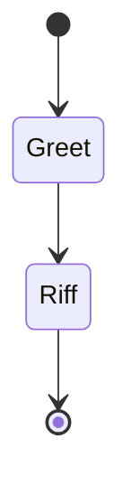
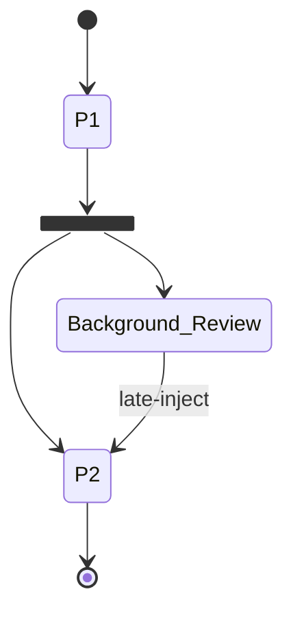
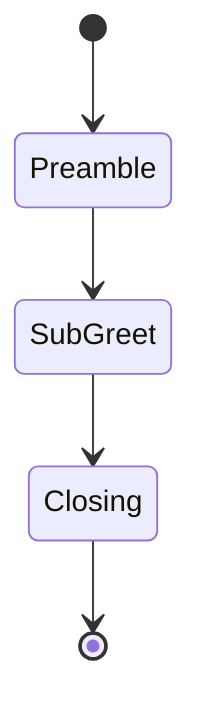
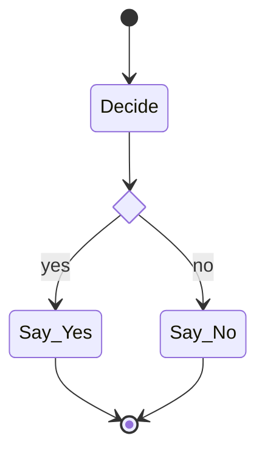
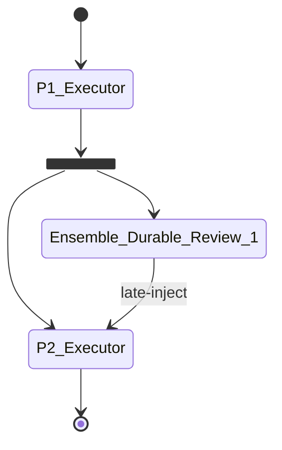
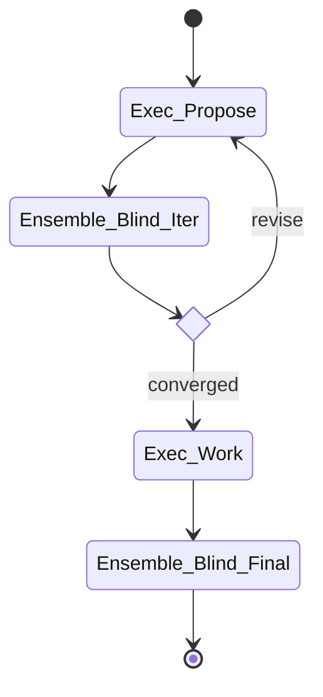

# Workflow examples

Workflow specs for `bro orchestrate run`. Each file is a JSON document with structured metadata plus an embedded `stateDiagram-v2` that describes the control flow. The daemon cross-validates the two halves before any dispatch.

Run any of these:

```bash
bro orchestrate run examples/workflows/<file>.json
```

Point `bro` at a specific daemon port (e.g. dev on 7265) via env or flag:

```bash
BRO_PORT=7265 bro orchestrate run examples/workflows/e2e-smoke.json
bro orchestrate run examples/workflows/e2e-smoke.json --url http://127.0.0.1:7265
```

---

## Catalog

### `e2e-smoke.json` — two-turn durable-actor probe

The minimum viable workflow. Two nodes, one durable executor, prompt substitution between turns. Demonstrates that:

- The daemon loads + validates a spec
- Sequential dispatch works
- `durable: true` makes node 2 a `bro_resume` of node 1's session (same `session_id`)
- `${Greet.output}` interpolates prior output into the next prompt



Requires a `probe-haiku` brofile on the daemon. Create one with:

```
bro_brofile(action="create", name="probe-haiku", provider="claude",
            model="claude-haiku-4-5-20251001", effort="high", scope="global")
```

### `e2e-async-review.json` — fork + fire-and-forget + late_inject

The optimistic-review pattern with real async execution. `P1` completes → fork fires → `Background_Review` is dispatched as `fire_and_forget` and the main walk continues to `P2` → `P2` has `late_inject` from `Background_Review`, so at P2's entry the engine joins the review's output (with timeout) and folds it into P2's prompt via `${Background_Review.output}` substitution.



This is the pattern that used to require an LLM cosplaying a state machine to coordinate. Now it's deterministic: fork → async dispatch → sync continuation → join-at-next-turn-boundary.

### `e2e-composition.json` — sub-workflow as a node

A parent workflow embeds a full sub-workflow via a node's `subworkflow` field. The sub-workflow compiles and validates at parent-compile time; at dispatch time it runs as a unit (opening its own arc thread) and its per-node outputs are concatenated (labeled `sub:<node>`) into the parent node's output, available to downstream template substitutions.



`SubGreet` is the composition point — its own mermaid + actors + nodes live inside it. Recursion is depth-limited (5 by default). This is how reusable templates (crucible, ensemble-consensus, etc.) become library-callable rather than pasted-prose.

### `e2e-policy.json` — workflow-level policy packet (advisor-as-packet)

Attaches a `policy_packet` to the workflow itself. At every node boundary, the engine builds an arc-state entity (step, completed, in-flight, last verdict, visit counts) and applies the packet. The classification drives an arc-level action:

- `halt` — stop the arc (error exit)
- `escalate` — write a `blocked` note on the arc thread, continue
- `warn` — write a `surprise` note, continue
- anything else — no-op

This is the "advisor as packet" move — replacing a continuous LLM advisor round with a deterministic rule evaluator. The arc thread picks up the verdicts as regular notes; `bro orchestrate status` surfaces them in the trail.

Requires a policy packet with an appropriate lattice. Compile one like:

```
bbox_compile(
  domain="workflow/arc-policy",
  classification_lattice=["halt", "escalate", "warn", "continue"],
  prefix_inference={"halt_": "halt", "escalate_": "escalate", "warn_": "warn", "continue_": "continue"},
  rules=[
    {"id": "halt_too_many_steps",
     "antecedent": {"op": "Gt", "field": "step", "value": 20},
     "consequent": "HALT"},
    {"id": "continue_default", "classification": "continue", "emit": "fallback",
     "antecedent": {"op": "True"}, "consequent": "CONTINUE"}
  ]
)
```

### `e2e-gated.json` — gated choice with branch selection

Adds gate packets + a `<<choice>>` node. An activity node produces a verdict via a compiled rule-packet; the following choice node routes to whichever outgoing edge matches the verdict. Unpicked branches don't dispatch.



Requires a yes/no gate packet. Compile one like so:

```
bbox_compile(
  domain="workflow/yes-no-gate",
  classification_lattice=["yes", "no"],
  prefix_inference={"yes_": "yes", "no_": "no"},
  rules=[
    {"id": "yes_said_yes",
     "antecedent": {"op": "StringContains", "field": "output", "needle": "YES"},
     "consequent": "YES"},
    {"id": "no_said_no",
     "antecedent": {"op": "StringContains", "field": "output", "needle": "NO"},
     "consequent": "NO"}
  ]
)
```

Then plug the returned packet id into the workflow's `"gate"` field.

### `optimistic.json` — async ensemble steering (spec only — needs an `ensemble` team on the daemon)

Ensemble version of the optimistic-review shape in `e2e-async-review.json` — phase 1 completes, fork kicks off a durable ensemble review asynchronously, phase 2 runs, ensemble results late-inject into phase 2's brief when available. The spec validates and the engine executes fork + fire-and-forget + late_inject + ensemble today; this example specifically requires a `red-team` team with ensemble members on the daemon.



### `blind.json` — converge-then-execute (spec-complete, needs ensemble team)

Rigid blind-review pattern: executor proposes, blind ensemble critiques, iterate until convergence, executor implements, fresh blind ensemble reviews the work. Uses a `<<choice>>` on the convergence step — same shape as `e2e-gated` but with ensemble critique bodies. Requires a `blind-review-team` team on the daemon; engine-side support for ensemble actors is landed.



---

## Authoring a new workflow

1. **Pick a pattern.** Start from one of the catalog specs that matches the interaction shape you want.
2. **Name your actors.** Each actor declares a kind (`executor`, `ensemble`, `advisor`, `user`), a brofile or team, and whether it's durable. Durable actors reuse the same session across nodes — the second dispatch becomes a `bro_resume`.
3. **Write the node metadata.** Every activity node needs an actor and a prompt. `${NodeName.output}` substitutes a prior node's text output. Gates, retry ceilings, and late-inject declarations are optional.
4. **Draw the graph in mermaid.** Use `[*]` for start/end, `A --> B` for sequential, `A --> B: label` for labeled edges into choice nodes. Declare `state X <<choice>>` for routing nodes that consume gate verdicts.
5. **Compile any gate packets** you referenced. Packet classifications must match the edge labels on the consuming choice node (e.g., lattice `["yes", "no"]` → edges labeled `yes` and `no`).
6. **Dry-run the spec** by loading it without dispatching — currently only via the Rust `CompiledWorkflow::summarize()` in tests, but the validator catches cross-reference mismatches up front. A dedicated dry-run CLI flag is on the list.
7. **Dispatch.** `bro orchestrate run <your.json>`. The event log shows every dispatch, gate verdict, choice route, and node completion.

## Common traps

- **Gate verdict lattice must match edge labels.** If your packet's lattice is `["approved", "revise"]`, your outgoing edges from the choice node must be labeled `approved` and `revise`. The engine refuses an unmatched verdict at runtime with a helpful error listing the available edge labels.
- **Durable actors persist across nodes *within one arc*, not across arc invocations.** A fresh `bro orchestrate run` starts a fresh set of sessions even if the same actor names appear.
- **Fork nodes use edge ORDER for semantics.** The first outgoing edge is the sync continuation (main walk). All other outgoing edges are fire-and-forget async branches. Re-ordering changes meaning.
- **`late_inject` joins at node entry, with a timeout.** The source node keeps running in the daemon; the target node's dispatch blocks until the source completes (with a 15-minute timeout). If you want zero-wait optimistic, interpose other sync work between the fork and the late-inject target so the source has time to complete.
- **Fan-out on non-choice non-fork nodes is a spec error.** Only `<<choice>>` (verdict routing) and `<<fork>>` (async fan-out) may have multiple outgoing edges. Activity nodes are strictly single-successor.
- **Retry ceiling is per-visit-count, not per-failure.** Each time a node is entered bumps its count; back-edges through choice nodes ARE retries, so the ceiling applies. If `retry.max_generations: 3`, a node can be visited at most 3 times.
- **Sub-workflow recursion is depth-limited.** Default ceiling is 5 levels deep. Exceeding halts the arc.
- **The spec's embedded graph string must include `stateDiagram-v2` as the header.** The parser rejects any other mermaid diagram kind.

## When not to use a workflow

Free-form single-turn work doesn't need a workflow — just `bro_exec`. Workflows pay off when:

- The arc spans multiple phases with distinct actors
- You want mechanical gates (packets) deciding advance vs. retry vs. halt
- You need the arc to survive LLM context compaction (the daemon holds state, not any LLM)
- You want inspectable re-runnable protocols — spec-as-code rather than prose-as-protocol
